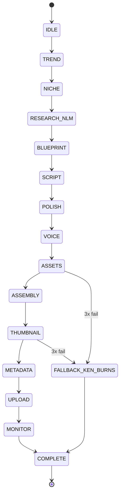
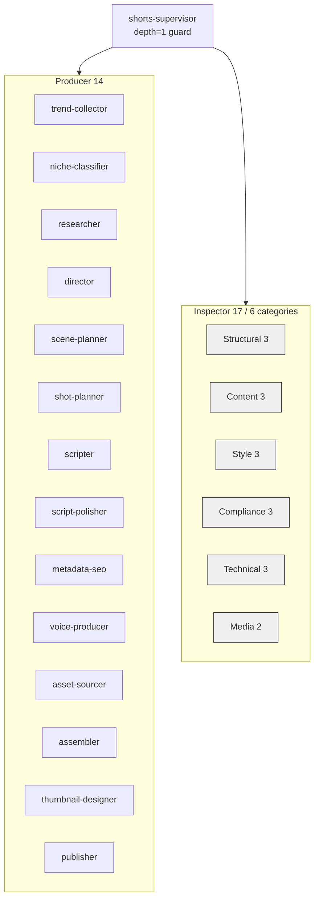
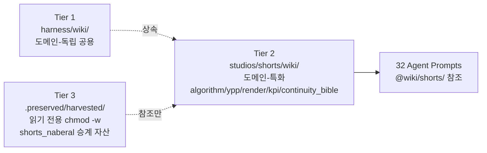

<objective>
Write single-file `docs/ARCHITECTURE.md` that satisfies SC#1 — new session onboarding in ≤ 30 minutes reading time. Content follows D-01 layered structure (12 GATE state machine → 17 inspector categories → 3-Tier wiki → external integrations), D-02 Mermaid diagrams (≥ 3: stateDiagram-v2 + 2 flowchart), D-03 reading time annotations per section (total ≤ 30 min; 5 min tolerance), D-04 single file (no docs/architecture/*.md split).

Purpose: Target SC#1 — "신규 세션 온보딩이 30분 이내 가능하다". This is the highest-risk deliverable of Phase 9 because three subtle format constraints interact: (a) total reading time via weighted formula, (b) Mermaid node count ≤ 40 per diagram (Pitfall 1), (c) TL;DR must sit within first 50 lines to dominate cold-read attention.

Output: docs/ARCHITECTURE.md (~500-800 lines) committed, test_architecture_doc_structure.py green.
</objective>

<execution_context>
@$HOME/.claude/get-shit-done/workflows/execute-plan.md
@$HOME/.claude/get-shit-done/templates/summary.md
</execution_context>

<context>
@.planning/phases/09-documentation-kpi-dashboard-taste-gate/09-CONTEXT.md
@.planning/phases/09-documentation-kpi-dashboard-taste-gate/09-RESEARCH.md
@tests/phase09/test_architecture_doc_structure.py
@.planning/ROADMAP.md
@wiki/README.md

<interfaces>
## ROADMAP Phase 9 SC#1 textual requirement (line 225)

> `docs/ARCHITECTURE.md`가 12 GATE state machine + 17 inspector 카테고리 + 3-Tier 위키 구조를 다이어그램과 함께 문서화하여 신규 세션 온보딩이 30분 이내 가능하다

## Required sections (D-01 layered order)

1. TL;DR (⏱ 2 min) — pinned at top, within first 50 lines
2. 1. State Machine (12 GATE) (⏱ 6 min) — Mermaid stateDiagram-v2
3. 2. Agent Team (17 Inspector / 14 Producer / 1 Supervisor) (⏱ 8 min) — Mermaid flowchart TD
4. 3. 3-Tier Wiki (⏱ 5 min) — Mermaid flowchart LR
5. 4. External Integrations (⏱ 4 min) — YouTube API v3 + GitHub + Kling/Runway/Typecast/Shotstack/NotebookLM
6. 5. Hard Constraints + Hook 3종 (⏱ 3 min)

Total: 28 min (under 30 with 2 min slack)

## 12 GATE state machine (Mermaid stateDiagram-v2) — exact syntax from 09-RESEARCH.md §Pattern 2



## Agent team flowchart TD — exact syntax from 09-RESEARCH.md §Pattern 3



## 3-Tier wiki flowchart LR — exact syntax from 09-RESEARCH.md §Pattern 4



## Hard Constraints (from ROADMAP §300-309) — include verbatim in §5

- `skip_gates=True` + `TODO(next-session)` = pre_tool_use Hook physical ban
- SKILL.md ≤ 500줄, description ≤ 1024자, 에이전트 총합 32명 (Producer 14 + Inspector 17 + Supervisor 1)
- 오케스트레이터 500~800줄 (5166줄 드리프트 재발 금지)
- 32 inspector 전수 이식 금지 (AF-10) — 17 inspector 6 카테고리 통합만
- shorts_naberal 원본 수정 금지 — Harvest는 읽기만
- 영상 T2V 금지 (NotebookLM T1) — I2V + Anchor Frame only
- K-pop 트렌드 음원 직접 사용 금지 (AF-13)
- Selenium 업로드 영구 금지 (AF-8) — YouTube Data API v3 공식만
</interfaces>
</context>

<tasks>

<task id="9-01-01">
  <action>
Create `docs/ARCHITECTURE.md` (~500-800 lines). Follow D-01 layered structure. File MUST begin with:

```markdown
# ARCHITECTURE — naberal-shorts-studio

**⏱ Reading time:** ~28 min (TL;DR 2 min → 5 sections 26 min)
**Last updated:** 2026-04-20
**Audience:** New session loading this codebase for the first time
**Phase status:** Phase 8 complete (8/8 plans shipped 2026-04-19). Phase 9 in progress.

## TL;DR (⏱ 2 min)

- **What:** AI agent team produces 3~4 YouTube Shorts/week toward YPP entry (1000 subs + 10M annual views).
- **Pipeline:** 12 GATE state machine enforced by pre_tool_use Hook (skip_gates physically banned).
- **Agents:** 32 total — 14 Producer + 17 Inspector (6 categories) + 1 Supervisor.
- **Wiki:** 3-Tier — harness (공용) / shorts (도메인) / harvested (읽기 전용).
- **External:** YouTube Data API v3 + Kling 2.6 Pro / Runway Gen-3 / Typecast / ElevenLabs / Shotstack / NotebookLM.
- **Hard constraints:** No T2V. No Selenium. No K-pop raw audio. Orchestrator 500-800 lines. 32 agents fixed.
- **Repository:** `github.com/kanno321-create/shorts_studio` (Private, Phase 8 REMOTE-01).
```

After TL;DR, insert `## 1. State Machine (12 GATE) (⏱ 6 min)` containing:
- 3-sentence intro explaining the DAG gate design (Phase 5 ORCH-02/07)
- The Mermaid stateDiagram-v2 block exactly as shown in the `<interfaces>` block
- Short table enumerating each gate's responsibility (15 rows: IDLE + 14 operational gates)
- `verify_all_dispatched()` explanation (13 operational gates count, NOT 17 per Phase 7 Correction 1)
- Reference: `scripts/orchestrator/shorts_pipeline.py`

Then `## 2. Agent Team (17 Inspector / 14 Producer / 1 Supervisor) (⏱ 8 min)` containing:
- 3-sentence intro (Phase 4 AGENT-01..05)
- Mermaid flowchart TD block exactly as shown in `<interfaces>`
- Sub-section "Producer 14" listing the 14 agent names (one line each, with `.claude/agents/producers/<name>/AGENT.md` path)
- Sub-section "Inspector 17 / 6 categories" with 6 category rows: Structural 3 / Content 3 / Style 3 / Compliance 3 / Technical 3 / Media 2
- Sub-section "LogicQA pattern" — Main-Q + 5 Sub-Qs, maxTurns=3 standard, factcheck=10, tone-brand=5, regex-style=1
- Sub-section "VQQA semantic gradient feedback" — Producer retry uses `<prior_vqqa>` input block (Phase 4 RUB-03)

Then `## 3. 3-Tier Wiki (⏱ 5 min)` containing:
- 3-sentence intro (Phase 6 WIKI-01..06)
- Mermaid flowchart LR block exactly as shown in `<interfaces>`
- Enumeration of the 3 tiers with purpose:
  - Tier 1: `../harness/wiki/` — 도메인-독립 공용
  - Tier 2: `wiki/` — 5 categories (algorithm / ypp / render / kpi / continuity_bible)
  - Tier 3: `.preserved/harvested/` — shorts_naberal 승계, chmod -w immutable
- NotebookLM Fallback Chain 3-tier explanation (RAG → grep wiki → hardcoded defaults, Phase 6 WIKI-04)
- Continuity Bible Prefix auto-injection in Shotstack filter[0] (Phase 6 WIKI-02)

Then `## 4. External Integrations (⏱ 4 min)` containing:
- YouTube Data API v3 (Phase 8 PUB-02) — OAuth InstalledAppFlow, config/client_secret.json + config/youtube_token.json
- GitHub Private repo + git submodule harness (Phase 8 REMOTE-01..03)
- Video generation chain: Kling 2.6 Pro primary → Runway Gen-3 Alpha Turbo backup → Ken Burns fallback (Phase 5 VIDEO-04, Phase 7 TEST-04)
- Audio: Typecast primary / ElevenLabs fallback (Phase 4 AUDIO-01)
- Composite render: Shotstack (Phase 5 VIDEO-05)
- NotebookLM 2-notebook (general / channel-bible) via `scripts/notebooklm/query.py` subprocess wrapper (Phase 6 D-6/D-7)
- KPI measurement (Phase 9 declares): YouTube Analytics API v2, endpoint `GET https://youtubeanalytics.googleapis.com/v2/reports`, OAuth scope `yt-analytics.readonly`, metrics `audienceWatchRatio` + `averageViewDuration` (wiring is Phase 10)

Then `## 5. Hard Constraints + Hook 3종 (⏱ 3 min)` containing:
- Copy all 8 Hard Constraints from `<interfaces>` verbatim as bullet list
- Hook 3종 차단 sub-section:
  1. `skip_gates=True` — pre_tool_use regex ban
  2. `TODO(next-session)` — pre_tool_use regex ban
  3. try-except silent fallback — reviewed per `deprecated_patterns.json` (Phase 5 + Phase 6 extended)
- FAILURES.md append-only Hook `check_failures_append_only` (Phase 6 D-11)
- SKILL_HISTORY backup Hook `backup_skill_before_write` (Phase 6 D-12)
- 30-day aggregation D-13 (FAILURES pattern ≥ 3 → SKILL.md.candidate → 7-day staged rollout)

End with `## References` section listing:
- `.planning/ROADMAP.md`
- `.planning/REQUIREMENTS.md`
- `.planning/phases/{01..08}/*-SUMMARY.md` (hyperlinks)
- `wiki/kpi/kpi_log.md` (Phase 9 companion — Plan 09-02)
- `wiki/kpi/taste_gate_protocol.md` (Phase 9 companion — Plan 09-03)

MUST include reading time annotations in format `⏱ N min` (ASCII stopwatch emoji). 5 annotations total: 2 (TL;DR) + 6 + 8 + 5 + 4 + 3 = 28 min (under 30).

MUST NOT include:
- `skip_gates=True` as live code (OK as mentioned in Hook 3종 차단 example with explanation)
- `TODO(next-session)` anywhere
- PlantUML / ASCII art diagrams
- Reference to split `docs/architecture/*.md` files

Korean prose allowed and encouraged where semantically native (section intros, emphasis). English for technical identifiers (file paths, API names).
  </action>
  <read_first>
    - docs/.gitkeep (confirms docs/ exists from Plan 09-00)
    - tests/phase09/test_architecture_doc_structure.py (the 6 tests this doc must satisfy)
    - .planning/phases/09-documentation-kpi-dashboard-taste-gate/09-RESEARCH.md §Architecture Patterns §Pattern 1-4 (layout + 3 Mermaid diagrams verbatim)
    - .planning/phases/09-documentation-kpi-dashboard-taste-gate/09-RESEARCH.md §Reading Time Methodology (weighted formula)
    - .planning/phases/09-documentation-kpi-dashboard-taste-gate/09-RESEARCH.md §Pitfall 1 (≤ 40 nodes/diagram) + §Pitfall 4 (reading time)
    - .planning/ROADMAP.md §300-309 (Hard Constraints verbatim)
    - .planning/ROADMAP.md §118-140 (Phase 5 orchestrator content)
    - .planning/ROADMAP.md §89-114 (Phase 4 agent team content)
    - wiki/README.md (3-Tier wiki category definitions)
  </read_first>
  <acceptance_criteria>
    - `test -f docs/ARCHITECTURE.md` exits 0
    - `wc -l < docs/ARCHITECTURE.md` outputs a number >= 300
    - `grep -c '^```mermaid$' docs/ARCHITECTURE.md` outputs `>= 3`
    - `grep -q 'stateDiagram-v2' docs/ARCHITECTURE.md`
    - `grep -qE 'flowchart (TD|LR)' docs/ARCHITECTURE.md`
    - `grep -q '## TL;DR' docs/ARCHITECTURE.md`
    - `head -50 docs/ARCHITECTURE.md | grep -q 'TL;DR'` (TL;DR within first 50 lines)
    - `grep -cE '⏱\s*~?[0-9]+\s*min' docs/ARCHITECTURE.md` outputs `>= 4`
    - `python -c "import re, pathlib; t=pathlib.Path('docs/ARCHITECTURE.md').read_text(encoding='utf-8'); total=sum(int(m) for m in re.findall(r'⏱\s*~?(\d+)\s*min', t)); assert total <= 35, f'total {total} min exceeds 30+5 tolerance'"` exits 0
    - `grep -qE '12\s*GATE|State\s*Machine' docs/ARCHITECTURE.md`
    - `grep -qE '17\s*[Ii]nspector|[Aa]gent\s*[Tt]ree|[Aa]gent\s*[Tt]eam' docs/ARCHITECTURE.md`
    - `grep -qE '3-?[Tt]ier|[Ww]iki' docs/ARCHITECTURE.md`
    - `grep -qE '[Yy]ou[Tt]ube|[Gg]it[Hh]ub|[Nn]otebook[Ll][Mm]' docs/ARCHITECTURE.md`
    - `grep -q 'yt-analytics.readonly' docs/ARCHITECTURE.md` (KPI API scope for Phase 10 handoff)
    - `grep -q 'audienceWatchRatio' docs/ARCHITECTURE.md`
    - `grep -qE 'verify_all_dispatched|13\s*(operational\s*)?gate' docs/ARCHITECTURE.md` (Phase 7 Correction 1 anchor)
    - `grep -q 'Hook 3종' docs/ARCHITECTURE.md`
    - `grep -q 'TODO(next-session)' docs/ARCHITECTURE.md` (mentioned in Hook 3종 section)
    - `grep -c '^## ' docs/ARCHITECTURE.md` outputs `>= 6` (TL;DR + 5 sections + References)
    - `python -m pytest tests/phase09/test_architecture_doc_structure.py -x --no-cov` exits 0
  </acceptance_criteria>
  <automated>python -m pytest tests/phase09/test_architecture_doc_structure.py -x --no-cov</automated>
  <task_type>impl</task_type>
</task>

<task id="9-01-02">
  <action>
Run full Phase 9 test collection to confirm Wave 1 parallel plans don't collide with this plan's test surface:

```
python -m pytest tests/phase09/ --collect-only -q --no-cov
```

MUST exit 0. Plans 09-02 and 09-03 (running in parallel) should still collect without error.

Run Phase 9 isolated fast sweep:

```
python -m pytest tests/phase09/test_architecture_doc_structure.py -q --no-cov
```

MUST exit 0 (6+ tests green).

Run Phase 4-8 regression collection sweep to confirm this plan's doc-only changes do not break prior phases:

```
python -m pytest tests/phase04 tests/phase05 tests/phase06 tests/phase07 tests/phase08 --co -q --no-cov
```

MUST exit 0 (986+ test collection preserved).

NO code changes in this task — pure verification.
  </action>
  <read_first>
    - docs/ARCHITECTURE.md (just-written file)
    - tests/phase09/test_architecture_doc_structure.py (6 tests)
  </read_first>
  <acceptance_criteria>
    - `python -m pytest tests/phase09/ --collect-only -q --no-cov` exits 0
    - `python -m pytest tests/phase09/test_architecture_doc_structure.py -q --no-cov` exits 0
    - `python -m pytest tests/phase04 tests/phase05 tests/phase06 tests/phase07 tests/phase08 --co -q --no-cov` exits 0
    - All 6 tests in test_architecture_doc_structure.py PASS (no skipped tests)
  </acceptance_criteria>
  <automated>python -m pytest tests/phase09/test_architecture_doc_structure.py -q --no-cov</automated>
  <task_type>verify</task_type>
</task>

</tasks>

<verification>
1. `docs/ARCHITECTURE.md` exists with ≥ 300 lines.
2. Three Mermaid blocks present: stateDiagram-v2 (12 GATE) + flowchart TD (32 agents) + flowchart LR (3-Tier wiki).
3. TL;DR section at top (within first 50 lines).
4. Reading time annotations sum ≤ 35 min (30 target + 5 tolerance).
5. Layered sections present: State Machine → Agent Team → 3-Tier Wiki → External → Hook 3종.
6. `test_architecture_doc_structure.py` green (6 tests).
7. Phase 4-8 regression collection still clean.
</verification>

<success_criteria>
Plan 09-01 is COMPLETE when:
- `docs/ARCHITECTURE.md` ships with all 3 Mermaid diagrams, ≥ 4 reading-time annotations totaling ≤ 35 min, TL;DR in first 50 lines, layered 5 sections.
- `test_architecture_doc_structure.py` all 6 tests PASS.
- Phase 4-8 986+ collection preserved (doc-only change, zero production impact).
- SC#1 "12 GATE state machine + 17 inspector 카테고리 + 3-Tier 위키 구조를 다이어그램과 함께" requirement textually satisfied and grep-verifiable.
- Actual 30-min onboarding validation (cold-reader stopwatch) deferred to first Phase 10 session per 09-RESEARCH.md §Open Questions #1 — declared-time validation is sufficient for SC#1 phase gate.
</success_criteria>

<output>
Create `.planning/phases/09-documentation-kpi-dashboard-taste-gate/09-01-SUMMARY.md` documenting:
- File created (docs/ARCHITECTURE.md with line count)
- Mermaid block count + diagram types
- TL;DR line position
- Declared reading time total
- test_architecture_doc_structure.py result (6/6 PASS expected)
- Phase 4-8 regression collection result
- Commit hash
</output>
