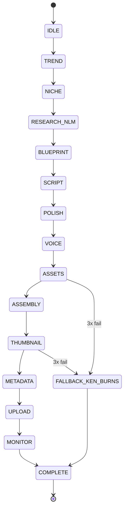
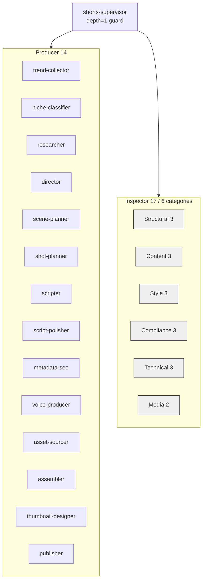
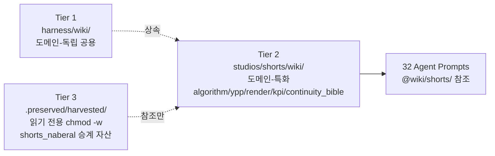

# Phase 9: Documentation + KPI Dashboard + Taste Gate — Research

**Researched:** 2026-04-20 (session #23, YOLO 연속 5세션, `--auto`)
**Domain:** Architecture documentation (Mermaid) + KPI measurement declaration (YouTube Analytics API v2 template) + Human-in-the-loop taste filter (markdown + Python append-only script)
**Confidence:** HIGH for existing-code patterns; MEDIUM-HIGH for YouTube Analytics v2 template (template only — real wiring is Phase 10); HIGH for Mermaid compatibility

---

<user_constraints>
## User Constraints (from CONTEXT.md)

### Locked Decisions (D-01 ~ D-14, non-negotiable)

**ARCHITECTURE.md (D-01 ~ D-04):**
- **D-01** Layered structure: `12 GATE state machine → 17 inspector categories → 3-Tier wiki → 외부 연동 (YouTube/GitHub/NotebookLM)`. Order is fixed (matches ROADMAP SC#1 문구 for verification).
- **D-02** Mermaid diagrams only (no PlantUML, no ASCII art). Minimum 3 diagrams: (1) 12 GATE state machine flow, (2) Agent team tree (Supervisor → 14 Producer + 17 Inspector), (3) 3-Tier wiki (harness/wiki ← studios/shorts/wiki ← .preserved/harvested/).
- **D-03** 30-min onboarding target measured via **Reading time annotations** per section (`⏱ N min`). TL;DR section pinned at top. Total ≤ 30 min to pass SC#1.
- **D-04** Single `docs/ARCHITECTURE.md` file. Split into `docs/architecture/*.md` is REJECTED — reason: new session confusion about where to start reading.

**KPI Declaration (D-05 ~ D-07):**
- **D-05** Path `wiki/kpi/kpi_log.md` (not `wiki/shorts/kpi_log.md` — ROADMAP typo; actual wiki structure is `wiki/{category}/`).
- **D-06** Hybrid format: (a) Target Declaration section with 3 KPI goals + measurement method + failure definition fixed, (b) Monthly Tracking section — `YYYY-MM` headed table with columns `video_id / title / 3sec_retention / completion_rate / avg_view_sec / taste_gate_rank`. Satisfies SC#2 "목표 선언 + 측정 방식 명시" simultaneously.
- **D-07** Measurement source = **YouTube Analytics API v2** (`audienceWatchRatio` + `averageViewDuration`). Real API integration is Phase 10. Phase 9 declares **endpoint + field names + weekly update cadence (Sunday KST)** only.

**Taste Gate Protocol (D-08 ~ D-11):**
- **D-08** Semi-automated: script auto-selects top-3 / bottom-3 by 3-sec retention over last 30 days. 대표님 writes evaluation columns (1-5 score + comment) only.
- **D-09** Evaluation form = Markdown single file (`wiki/kpi/taste_gate_YYYY-MM.md`). Google Form REJECTED (external dep + privacy + git-untracked).
- **D-10** First dry-run uses **synthetic sample 6** based on shorts_naberal 탐정/조수 페르소나 (realistic titles, NOT placeholder "테스트용 쇼츠 #1"). Real evaluation happens Phase 10 Month 1.
- **D-11** Monthly cadence: **매월 1일 KST 09:00 자동 알림**. Phase 9 documents protocol only (`wiki/kpi/taste_gate_protocol.md`); cron in Phase 10.

**FAILURES Feedback Path (D-12 ~ D-14):**
- **D-12** Tagged auto-append via `scripts/taste_gate/record_feedback.py` — parses completed `taste_gate_YYYY-MM.md` → appends `### [taste_gate] YYYY-MM 리뷰 결과` section to `.claude/failures/FAILURES.md`. Manual copy-paste eliminated.
- **D-13** Only scores ≤ 3 escalate to FAILURES.md (noise filter). Top-3 (usually 4-5) go to `kpi_log.md` only as "유지" category.
- **D-14** SC#4 end-to-end validation uses synthetic data: dry-run taste_gate file → `record_feedback.py` → verify FAILURES.md has new entry. Real video data arrives in Phase 10 Month 1.

### Claude's Discretion
- Mermaid diagram node styling / colors / sort order
- `taste_gate_YYYY-MM.md` evaluation column labels ("품질" vs "완성도" vs "임팩트") — propose v1 in dry-run, iterate from 대표님 feedback
- Script error messages Korean/English — **Korean priority** (harness convention)
- ARCHITECTURE.md code example language — **Python** (project standard)

### Deferred Ideas (OUT OF SCOPE)
- 실제 30-day KPI data collection → Phase 10
- YouTube Analytics API 실연동 → Phase 10 (`scripts/analytics/fetch_kpi.py`)
- Auto Research Loop (KPI → NotebookLM RAG 피드백) → Phase 10 (REQ-09)
- SKILL.md 자동 patch → Phase 10 Month 1~2 이후 batch (D-2 저수지 규율)
- 다국어 ARCHITECTURE.md → uncertain need, deferred
- Taste Gate 기준 다변화 (3 → 5 KPI) → Phase 10 이후 데이터 축적 후 재검토
- SKILL.md patch 반영 금지 (Phase 10 first 1~2 months)
- 다중 채널 / 커스텀 메트릭 → post-v1

</user_constraints>

<phase_requirements>
## Phase Requirements

| ID | Description | Research Support |
|----|-------------|------------------|
| **KPI-05** | 월 1회 Taste gate — 대표님이 직접 상위 3 / 하위 3 영상 평가 (B-P4 차단) | §Markdown Forms + §record_feedback.py design (D-08/D-09/D-12); synthetic dry-run in §Wave Breakdown |
| **KPI-06** | 목표 지표: 3초 retention > 60%, 완주율 > 40%, 평균 시청 > 25초 | §YouTube Analytics v2 (D-07 endpoint + fields); §kpi_log.md Hybrid format (D-06) |

**Non-requirement success criteria (from ROADMAP §219-229):**
- SC#1 ARCHITECTURE.md — 30-min onboarding via Mermaid + reading-time annotations
- SC#2 KPI targets declared with measurement method
- SC#3 Taste Gate protocol documented + first dry-run completed
- SC#4 Taste Gate → FAILURES.md flow proven via synthetic data

</phase_requirements>

## Summary

1. **Phase 9 is 95% documentation + 5% Python glue.** No new agents, no new SKILLs, no orchestrator changes. One small script (`record_feedback.py`, ~150 lines, stdlib-only, mirrors `scripts/failures/aggregate_patterns.py` pattern).
2. **Mermaid 3종 다이어그램 + single-file ARCHITECTURE.md** is the highest-risk deliverable — GitHub caps Mermaid at ~500 nodes, Obsidian renders fine within 200, and VSCode needs the official Mermaid extension. Target ≤ 40 nodes per diagram for 30-min onboarding.
3. **YouTube Analytics API v2 is template-only.** OAuth scope `yt-analytics.readonly`, endpoint `GET https://youtubeanalytics.googleapis.com/v2/reports`, metrics `audienceWatchRatio,averageViewDuration`. Real integration defers to Phase 10 — Phase 9 declares the contract without wiring.

**Primary recommendation:** Execute Phase 9 as **3 waves / 5-6 plans**. Wave 1 = documentation foundation (ARCHITECTURE.md skeleton + kpi_log.md + taste_gate_protocol.md). Wave 2 = Python glue (`scripts/taste_gate/record_feedback.py` with full TDD). Wave 3 = synthetic dry-run (D-10 samples → script invocation → FAILURES.md verification → VALIDATION.md flip). No parallel-risk overlap between waves; Wave 1 plans can run in parallel within themselves.

---

## Standard Stack

### Core (no new dependencies)

| Component | Version | Purpose | Why Standard |
|-----------|---------|---------|--------------|
| **Mermaid** | Latest (native) | Architecture diagrams | GitHub/VSCode/Obsidian all render natively. Zero external tooling. D-02 locked. |
| **Python stdlib** | 3.11+ (project baseline) | `record_feedback.py` | `argparse`, `pathlib`, `re`, `json`, `hashlib`, `datetime`, `sys` — mirrors `scripts/failures/aggregate_patterns.py` discipline (stdlib only, UTF-8, cp949 guard). |
| **YouTube Analytics API v2** | v2 (GA, stable since 2016) | KPI measurement source (template) | D-07 locked. Endpoint declared, wired Phase 10. |
| **Obsidian frontmatter** | Existing convention | Wiki node metadata | `wiki/kpi/retention_3second_hook.md` already uses `category/status/tags/updated/source_notebook` schema — taste_gate_protocol.md must match. |

### Version verification

```bash
# No new installs required. Confirm existing:
python --version    # Must be 3.11+ (project baseline per pyproject.toml)
```

`record_feedback.py` is pure stdlib. No `pip install`.

### Alternatives Considered (all REJECTED by CONTEXT.md)

| Instead of | Could Use | Why Rejected |
|------------|-----------|--------------|
| Mermaid | PlantUML / Graphviz / ASCII art | D-02 locked. External tooling / doesn't render on GitHub |
| Single `docs/ARCHITECTURE.md` | Split `docs/architecture/*.md` | D-04 locked. "어디부터 읽어야 하는가" 혼란 방지 |
| `wiki/kpi/taste_gate_YYYY-MM.md` | Google Form / Airtable | D-09 locked. External dep + privacy + git-untracked |
| YouTube Analytics v2 | YouTube Data API v3 `videos.list` basic stats | v3 does not expose `audienceWatchRatio` retention curves. D-07 anchored to v2. |
| `wiki/kpi/kpi_log.md` | `wiki/shorts/kpi_log.md` (ROADMAP wording) | D-05 locked. Actual wiki structure is `wiki/{category}/`; ROADMAP 문구는 typo. |

---

## Architecture Patterns

### Recommended File Structure

```
docs/                                 # NEW directory (Phase 9 first write)
└── ARCHITECTURE.md                   # ~800-1200 lines, 3 Mermaid diagrams, TL;DR at top

wiki/kpi/
├── MOC.md                            # Existing — update Planned Nodes checkboxes
├── retention_3second_hook.md         # Existing (Phase 6)
├── kpi_log.md                        # NEW — Hybrid (Target Declaration + Monthly Tracking)
├── taste_gate_protocol.md            # NEW — Monthly process documentation
└── taste_gate_2026-04.md             # NEW — first dry-run file (D-10 synthetic 6)

scripts/taste_gate/                   # NEW directory (mirrors scripts/failures/ layout)
├── __init__.py                       # Empty namespace marker (7 lines, mirror pattern)
└── record_feedback.py                # ~150-200 lines, stdlib only, append-only FAILURES write

tests/phase09/                        # NEW test directory (mirrors tests/phase08/)
├── __init__.py
├── conftest.py                       # Fixtures: synthetic taste_gate sample + tmp_path FAILURES.md
├── test_record_feedback.py           # Unit tests for parser + normalizer + escalation filter
├── test_score_threshold_filter.py    # D-13 unit: score > 3 skipped, ≤ 3 escalated
├── test_failures_append_only.py      # Hook integration: record_feedback.py writes are append-valid
├── test_architecture_doc_structure.py  # Grep for required sections + Mermaid block count
├── test_kpi_log_schema.py            # Target Declaration + Monthly Tracking headers present
├── test_taste_gate_form_schema.py    # 6 rows present + score column + comment column
└── phase09_acceptance.py             # SC 1-4 aggregator (mirrors phase08_acceptance.py)
```

### Pattern 1: Single-file ARCHITECTURE.md with Reading Time Annotations

**What:** One monolithic markdown with section-level `⏱ N min` annotations summing to ≤ 30 min.

**When to use:** New-session onboarding. Satisfies SC#1 verification.

**Layout (recommended):**
```markdown
# ARCHITECTURE.md — naberal-shorts-studio

**⏱ Reading time:** ~28 min (TL;DR 2 min → sections 26 min)
**Last updated:** 2026-04-YY
**Audience:** New session loading this codebase for the first time

## TL;DR (⏱ 2 min)
- **What:** AI agent team → 3~4 YouTube Shorts/week → YPP entry
- **Pipeline:** 13 operational GATEs (TREND → ... → COMPLETE)
- **Agents:** 32 total (14 Producer + 17 Inspector + 1 Supervisor)
- **Wiki:** 3-Tier (harness / studio / harvested)
- **External:** YouTube Data API v3 + Kling + Typecast + NotebookLM

## 1. State Machine (12 GATE) (⏱ 6 min)
[Mermaid stateDiagram-v2 here]

## 2. Agent Team (17 Inspector / 14 Producer / 1 Supervisor) (⏱ 8 min)
[Mermaid flowchart TD here]

## 3. 3-Tier Wiki (⏱ 5 min)
[Mermaid flowchart LR here]

## 4. External Integrations (⏱ 4 min)
...

## 5. Hard Constraints + Hook 3종 (⏱ 3 min)
...
```

### Pattern 2: Mermaid stateDiagram-v2 for 12 GATE

**Source:** [mermaid-js/mermaid docs](https://mermaid.js.org/syntax/stateDiagram.html) — GitHub/Obsidian native support confirmed.



**Node count: 17** (15 gates + IDLE + FALLBACK + 2 pseudo-states [*]) — well under GitHub 500-node cap and Obsidian 200-node comfort range.

### Pattern 3: Mermaid flowchart TD for Agent Tree



**Node count: 24** (SUP + 14 P + 6 I + 3 subgraph wrappers). Safe.

### Pattern 4: Mermaid flowchart LR for 3-Tier Wiki



**Node count: 4.** Minimal, clear.

### Pattern 5: Semi-automated Taste Gate Form (D-08 + D-09)

**File:** `wiki/kpi/taste_gate_YYYY-MM.md`

```markdown
---
category: kpi
status: dry-run | pending-review | completed
tags: [taste-gate, monthly-review]
month: 2026-04
reviewer: 대표님
selected_at: 2026-04-01T09:00:00+09:00
selection_method: semi-auto (top3 + bottom3 by 3sec_retention over last 30 days)
---

# Taste Gate 2026-04 — 월간 상/하위 3 영상 평가

## 📖 평가 방법

6개 영상 각각에 대해 3개 컬럼 작성:
- **품질 (1-5):** 전반적 영상 완성도 (5 = 대표님 기준 이상적)
- **한줄 코멘트:** 느낀 점 (한국어 자유 서술)
- **태그 (선택):** 재사용 / 재생산 / 폐기 / 후속편 후보 등

작성 완료 후 CLI 실행:
```
python scripts/taste_gate/record_feedback.py --month 2026-04
```

## 상위 3 (3초 retention 기준)

| # | video_id | title | 3sec_retention | 완주율 | 평균 시청 | **품질 (1-5)** | **한줄 코멘트** | **태그** |
|---|----------|-------|---------------:|-------:|----------:|:-------------:|:---------------|:---------|
| 1 | abc123 | "탐정이 조수에게 묻다: 23살 범인의 진짜 동기?" | 68% | 42% | 27초 | _ | _ | _ |
| 2 | def456 | "100억 갑부가 딱 한 번 울었던 순간" | 64% | 41% | 26초 | _ | _ | _ |
| 3 | ghi789 | "3번째 편지의 의미를 아시나요?" | 61% | 40% | 25초 | _ | _ | _ |

## 하위 3

| # | video_id | title | 3sec_retention | 완주율 | 평균 시청 | **품질 (1-5)** | **한줄 코멘트** | **태그** |
|---|----------|-------|---------------:|-------:|----------:|:-------------:|:---------------|:---------|
| 4 | jkl012 | "조수가 놓친 단서" | 48% | 28% | 19초 | _ | _ | _ |
| 5 | mno345 | "5번 방문한 이유" | 45% | 25% | 17초 | _ | _ | _ |
| 6 | pqr678 | "범인의 마지막 말" | 42% | 24% | 16초 | _ | _ | _ |
```

**Design rationale:** Table format beats list (6 items × 3 columns fit one screen in Obsidian/VSCode). Pre-filled columns are KPI data (read-only reference). 대표님 writes only the last 3 columns.

### Pattern 6: kpi_log.md Hybrid Format (D-06)

```markdown
---
category: kpi
status: ready
tags: [kpi, monthly-tracking, retention, completion, avg-watch]
updated: 2026-04-YY
---

# KPI Log — 월별 추적 + 목표 선언

## Part A: Target Declaration (KPI-06)

| 지표 | 목표 | 임계 (재제작 trigger) | 측정 방식 | 측정 주기 |
|------|------|----------------------|-----------|-----------|
| 3초 retention | **> 60%** | < 50% | YouTube Analytics v2 `audienceWatchRatio[3]` | 업로드 7일 후 + 주 1회 일요일 KST |
| 완주율 (Completion Rate) | **> 40%** | < 30% | `audienceWatchRatio[59]` (60초 Shorts 기준) | 업로드 7일 후 + 주 1회 일요일 KST |
| 평균 시청 시간 | **> 25초** | < 18초 | `averageViewDuration` (초 단위) | 업로드 7일 후 + 주 1회 일요일 KST |

### API Contract (Phase 10 실연동 대상)
- **Endpoint:** `GET https://youtubeanalytics.googleapis.com/v2/reports`
- **OAuth scope:** `https://www.googleapis.com/auth/yt-analytics.readonly`
- **Required params:**
  - `ids=channel==MINE`
  - `startDate` / `endDate` (YYYY-MM-DD)
  - `metrics=audienceWatchRatio,averageViewDuration`
  - `dimensions=elapsedVideoTimeRatio` (for 3-sec point)
  - `filters=video==<videoId>`
- **Quota:** ~1 unit per report (Analytics API separate quota from Data API v3's 10,000 units/day)
- **Shorts filter:** `filters=video==<id>;uploaderType==SELF` (Shorts shelf 트래픽은 `trafficSourceType=SHORTS`로 별도 집계)

### 실패 정의
- 3종 지표 중 **2개 이상 FAIL** → 해당 에피소드 Part B 하위 3 자동 배치 → 다음 월 Taste Gate 검토 대상
- 단일 지표 < 임계 + 단발성 → kpi_log.md 주의 표시만, FAILURES.md 승격 없음

## Part B: Monthly Tracking

### 2026-04 (첫 실 데이터는 Phase 10)

| video_id | title | upload_date | 3sec_retention | completion_rate | avg_view_sec | taste_gate_rank | notes |
|----------|-------|-------------|---------------:|----------------:|-------------:|:---------------:|-------|
| _ | _ | _ | _ | _ | _ | _ | Phase 10 Month 1 수집 대상 |

### Dry-run 2026-04 (synthetic sample — D-10)

[6 synthetic rows as shown in Pattern 5]
```

### Anti-Patterns to Avoid

| Anti-Pattern | Why Bad | Use Instead |
|--------------|---------|-------------|
| Split `docs/architecture/{01-state-machine,02-agents,...}.md` | D-04 REJECTED — session confusion | Single `docs/ARCHITECTURE.md` |
| Mermaid with > 50 nodes in one diagram | Obsidian renders slowly, readability fails 30-min goal | Split into 2 diagrams or use subgraph grouping |
| ASCII art state machine | D-02 REJECTED, GitHub doesn't render consistently | Mermaid stateDiagram-v2 |
| Google Form for taste_gate | D-09 REJECTED — external dep, git-untracked | `wiki/kpi/taste_gate_YYYY-MM.md` |
| Append to FAILURES.md with manual copy-paste | D-12 REJECTED — error-prone | `scripts/taste_gate/record_feedback.py` |
| Synthetic titles like "테스트용 쇼츠 #1" | CONTEXT.md §specifics FORBIDS placeholder | 실제 탐정/조수 페르소나 기반 그럴듯한 6개 제목 |
| Escalate ALL taste_gate scores to FAILURES.md | D-13 REJECTED — noise | Only scores ≤ 3 |

---

## Don't Hand-Roll

| Problem | Don't Build | Use Instead | Why |
|---------|-------------|-------------|-----|
| Architecture diagram rendering | Custom diagram tool / screenshot | **Mermaid fenced code block** | GitHub/VSCode/Obsidian native rendering, zero tooling deps |
| FAILURES.md append enforcement | Custom file-lock / manual discipline | **Existing Hook `check_failures_append_only`** (Phase 6 D-11) | Hook already physically blocks modification of prior entries; `record_feedback.py` just needs to obey append-only contract |
| Script CLI argument parsing | Manual `sys.argv` parsing | **`argparse.ArgumentParser`** | Already standard in `scripts/failures/aggregate_patterns.py`; mirrors that shape |
| Markdown parsing (taste_gate form) | Third-party parser (`mistune`, `markdown2`) | **`re` + `pathlib`** (stdlib) | `aggregate_patterns.py` uses `re.compile(r"^### (FAIL-[\w]+):\s*(.+?)$", re.MULTILINE)` — same pattern works for taste_gate table rows |
| Date/time handling | `arrow` / `pendulum` | **`datetime` + `zoneinfo.ZoneInfo("Asia/Seoul")`** | Already used in `scripts/publisher/kst_window.py` |
| Reading time calculation | LLM-based estimator / word counter service | **`len(content.split()) / 200 WPM`** simple formula | §Reading Time Methodology below |
| YouTube API wrapper (Phase 9 only) | Custom `requests.get` wrapper | **SKIP — Phase 9 is template only** | D-07: real wiring is Phase 10 `scripts/analytics/fetch_kpi.py` |

**Key insight:** Phase 9 is *declarative*, not *executing*. The `record_feedback.py` script is the only non-trivial code, and it exists entirely within existing patterns (stdlib argparse + re + pathlib + UTF-8 + cp949 guard, mirroring `scripts/failures/aggregate_patterns.py`).

---

## Runtime State Inventory

**Category classification:** Rename/refactor? **No — Phase 9 is a greenfield doc/script phase.** However, the inventory questions still apply because Phase 9 touches wiki structure and FAILURES.md:

| Category | Items Found | Action Required |
|----------|-------------|------------------|
| **Stored data** | None — Phase 9 does NOT migrate existing data. `wiki/kpi/retention_3second_hook.md` already exists (ready). `wiki/kpi/MOC.md` has placeholder checkboxes for `kpi_log_template.md` (line 21) — Phase 9 creates concrete file and flips checkbox. | Flip MOC.md checkbox: `- [ ] kpi_log_template.md` → `- [x] kpi_log.md — Hybrid format (Phase 9 ready)`. No data migration. |
| **Live service config** | None — Phase 9 does NOT integrate with live services. YouTube Analytics API v2 is declared in text only; no OAuth token added, no cron registered. | None. |
| **OS-registered state** | None — no Windows Task Scheduler / launchd / systemd entries in Phase 9. D-11 says "매월 1일 KST 09:00 자동 알림" but explicitly defers cron to Phase 10. | None. |
| **Secrets/env vars** | None new. Existing `config/client_secret.json` + `config/youtube_token.json` (Phase 8) will be reused by Phase 10 `fetch_kpi.py`; Phase 9 references them in ARCHITECTURE.md but doesn't read them. | None. |
| **Build artifacts** | None — no compiled binaries, no egg-info. `scripts/taste_gate/` is new pure-Python namespace package (same pattern as `scripts/failures/`). | None. |

**Verified via:** `ls scripts/taste_gate/` returns "No such file or directory" (not yet created — Phase 9 creates). `ls wiki/kpi/` returns `MOC.md  retention_3second_hook.md` (Phase 9 adds 3 files: `kpi_log.md`, `taste_gate_protocol.md`, `taste_gate_2026-04.md`).

---

## Environment Availability

Phase 9 has **minimal external dependencies** (documentation + stdlib Python script). One verification concern: Mermaid rendering for manual validation.

| Dependency | Required By | Available | Version | Fallback |
|------------|------------|-----------|---------|----------|
| Python 3.11+ | `record_feedback.py` | ✓ (project baseline) | 3.11+ per pyproject.toml | — |
| Python `re` / `pathlib` / `argparse` / `hashlib` / `json` / `datetime` / `zoneinfo` | stdlib — no install | ✓ | stdlib 3.11 | — |
| `pytest` | Unit tests | ✓ (already in phase05/06/07/08 harness) | 8.x | — |
| Mermaid CLI (`mmdc`) | **Optional** Mermaid syntax validator in tests | ✗ (not installed) | — | Regex-based fence-block count + syntax-lite grep test (no render check) |
| GitHub Markdown renderer | Manual human review of diagrams | ✓ (web UI) | live | VSCode Mermaid extension as alternative |
| Obsidian | 대표님의 taste_gate 평가 편집 UX | Unknown (대표님 choice) | — | VSCode is guaranteed fallback (rejects-friendly GFM) |

**Missing dependencies with no fallback:** None — all blocking deps are Python stdlib.

**Missing dependencies with fallback:**
- **Mermaid CLI (`mmdc`):** Installing would allow `mmdc -i docs/ARCHITECTURE.md -o /tmp/check.svg` render-check in tests. Without it, we validate only:
  1. Fence-block count (≥ 3 Mermaid blocks in ARCHITECTURE.md)
  2. Block-type grep (`stateDiagram-v2`, `flowchart TD`, `flowchart LR`)
  3. Manual human review by 대표님
  
  **Recommendation:** Skip `mmdc` install for Phase 9. Defer to Phase 10 if Mermaid syntax drift ever bites. Current risk is LOW — Mermaid syntax is stable since 2023.

---

## Common Pitfalls

### Pitfall 1: Mermaid node overflow in a single diagram

**What goes wrong:** Diagram with 80+ nodes (e.g., 17 inspectors each as separate node + 14 producers + supervisor + gates) renders slowly in Obsidian and becomes unreadable. Violates 30-min onboarding target (SC#1).

**Why it happens:** Over-exhaustive literal representation of every agent.

**How to avoid:** Use `subgraph` grouping (Pattern 3 above). Represent "17 Inspector / 6 categories" as 6 category boxes, not 17 nodes. Keep each diagram ≤ 40 visible primitives.

**Warning signs:** Diagram takes > 3 seconds to render in Obsidian preview.

---

### Pitfall 2: FAILURES.md append-only Hook blocks legitimate record_feedback.py writes

**What goes wrong:** Hook `check_failures_append_only` (Phase 6 D-11) denies Write operations if existing content isn't exactly preserved. If `record_feedback.py` uses `open(path, "w")` instead of `open(path, "a")`, the write is rejected.

**Why it happens:** Hook matches on basename `FAILURES.md` regardless of path. It inspects the Write tool payload and denies if prior content isn't present as prefix.

**How to avoid:** `record_feedback.py` MUST use `open(path, "a", encoding="utf-8")` (append mode). Verify via test:
```python
# tests/phase09/test_failures_append_only.py
def test_record_feedback_uses_append_mode():
    import ast
    src = (ROOT / "scripts/taste_gate/record_feedback.py").read_text()
    tree = ast.parse(src)
    for node in ast.walk(tree):
        if isinstance(node, ast.Call) and getattr(node.func, "id", None) == "open":
            # Second arg must be 'a' or 'a+' for any FAILURES.md write
            ...
```

Alternative pattern (safer): read existing content → append new block → Write full string (Hook accepts this because prior content is preserved as prefix).

**Warning signs:** Hook logs `"FAILURES.md is append-only (D-11). ..."` denial message at test time.

---

### Pitfall 3: Synthetic sample becomes indistinguishable from real data

**What goes wrong:** Future Phase 10 reader sees `taste_gate_2026-04.md` dry-run file and mistakes it for real April 2026 data, polluting retrospective analysis.

**Why it happens:** Dry-run fixtures labeled with real month names.

**How to avoid:**
1. Frontmatter `status: dry-run` explicit (Phase 10 completes it flips to `status: completed`).
2. First line body: `> ⚠️ **DRY-RUN (D-10 synthetic sample)** — 실 데이터는 Phase 10 Month 1에서 수집. 이 파일은 포맷 검증용.`
3. Synthetic video_ids like `abc123` (6-char, not YouTube's 11-char) — obviously fake.

**Warning signs:** Re-reading the file cold makes you unsure if data is real.

---

### Pitfall 4: Reading time estimate lies

**What goes wrong:** ARCHITECTURE.md claims `⏱ 28 min` but actually takes 45+ min because code blocks + diagrams weren't accounted for.

**Why it happens:** Naive `word_count / 200 WPM` ignores that:
- Code blocks are 2-3× slower per "word" (parsing semantics)
- Mermaid diagrams are 30-90 sec each regardless of token count
- Tables slow to ~100 WPM effective rate

**How to avoid:** Use weighted formula:
```
reading_min = (prose_words / 200) + (code_words / 100) + (diagram_count × 1.0) + (table_rows × 0.1)
```

Validate with stopwatch: have a fresh reader (cold cache) read once and measure actual time. Iterate annotations if > 30 min.

**Warning signs:** Target 30 min but document is 1500+ lines with 3 Mermaid + 20 code blocks → likely 40+ min actual.

---

### Pitfall 5: Taste Gate score parser breaks on 대표님 manual edits

**What goes wrong:** 대표님 accidentally adds extra markdown (extra column, cell split, etc.) and `record_feedback.py` parser fails silently or produces wrong data.

**Why it happens:** Regex-based table parsing is fragile.

**How to avoid:**
1. Strict row regex with named groups:
   ```python
   ROW_RE = re.compile(
       r"^\|\s*(?P<rank>\d+)\s*\|\s*(?P<video_id>\w+)\s*\|\s*\"?(?P<title>[^\"\|]+?)\"?\s*\|"
       r"[^\|]*\|[^\|]*\|[^\|]*\|"  # skip 3 KPI cols
       r"\s*(?P<score>[1-5]|_)\s*\|\s*(?P<comment>[^\|]*?)\s*\|\s*(?P<tag>[^\|]*?)\s*\|",
       re.MULTILINE,
   )
   ```
2. Validation step: if `score == "_"` (unwritten) → print warning + skip row, don't fail. If score not in `{1,2,3,4,5}` → raise explicit `TasteGateParseError`.
3. Error messages in Korean per CLAUDE.md convention: `raise TasteGateParseError(f"{row_num}행 점수 '{score}' 오류 — 1-5 정수만 허용")`.

**Warning signs:** Parser returns 5 rows instead of 6 without warning.

---

### Pitfall 6: Hook 3종 차단 triggered by new script

**What goes wrong:** `scripts/taste_gate/record_feedback.py` contains `try: ... except: ...` or `skip_gates=True` reference and pre_tool_use Hook blocks the Write.

**Why it happens:** Hook enforces: (1) `skip_gates=True` physical ban, (2) `TODO(next-session)` ban, (3) try-except silent fallback ban.

**How to avoid:**
- No `try: ... except: pass` — use explicit `raise TasteGateParseError(...)` with Korean message
- No `TODO(next-session)` — if genuinely unfinished, raise `NotImplementedError` with clear reason
- No `skip_gates=True` anywhere in source

Run pre-commit: `python scripts/validate/validate_no_drift.py scripts/taste_gate/` (if exists, otherwise grep).

**Warning signs:** Hook denial on first Write attempt for `record_feedback.py`.

---

### Pitfall 7: Windows cp949 encoding breaks UTF-8 Korean output

**What goes wrong:** `record_feedback.py` prints Korean to stdout on Windows and throws `UnicodeEncodeError: 'cp949' codec can't encode character...`. This is a repeated pain point (Phase 6 STATE #28, Phase 8 pitfall).

**How to avoid:** Always include the cp949 guard (pattern from `smoke_test.py:270-271` and `aggregate_patterns.py`):

```python
if __name__ == "__main__":
    if hasattr(sys.stdout, "reconfigure"):
        sys.stdout.reconfigure(encoding="utf-8")
    sys.exit(main())
```

Tests must include a cp949 simulation (monkeypatch `sys.stdout.encoding = "cp949"` then call main).

**Warning signs:** CI/dev exec works, bash session on Windows throws Unicode error.

---

## Code Examples

### Example 1: `record_feedback.py` skeleton (derived from `aggregate_patterns.py`)

```python
#!/usr/bin/env python3
"""Taste Gate → FAILURES.md appender (D-12 implementation).

Parses wiki/kpi/taste_gate_YYYY-MM.md, filters rows with score <= 3 (D-13),
appends `### [taste_gate] YYYY-MM 리뷰 결과` block to .claude/failures/FAILURES.md.

Usage:
    python scripts/taste_gate/record_feedback.py --month 2026-04
    python scripts/taste_gate/record_feedback.py --month 2026-04 --dry-run  # prints block, does not write

Exit codes:
    0 = success (block appended or dry-run printed)
    2 = argparse error
    3 = taste_gate file not found / parse error
"""
from __future__ import annotations

import argparse
import re
import sys
from datetime import datetime
from pathlib import Path
from zoneinfo import ZoneInfo

FAILURES_PATH = Path(".claude/failures/FAILURES.md")
TASTE_GATE_DIR = Path("wiki/kpi")
KST = ZoneInfo("Asia/Seoul")

# Parses table row: | rank | video_id | title | 3sec | completion | avg | score | comment | tag |
ROW_RE = re.compile(
    r"^\|\s*(?P<rank>\d+)\s*\|\s*(?P<video_id>[\w-]+)\s*\|\s*\"?(?P<title>[^\"\|]+?)\"?\s*\|"
    r"\s*(?P<retention>[^\|]*?)\s*\|\s*(?P<completion>[^\|]*?)\s*\|\s*(?P<avg>[^\|]*?)\s*\|"
    r"\s*(?P<score>[1-5]|_)\s*\|\s*(?P<comment>[^\|]*?)\s*\|\s*(?P<tag>[^\|]*?)\s*\|",
    re.MULTILINE,
)


class TasteGateParseError(Exception):
    """Raised on malformed taste_gate_YYYY-MM.md."""


def parse_taste_gate(month: str) -> list[dict]:
    """Return list of rows with score, video_id, title, comment. Raises on malformed."""
    path = TASTE_GATE_DIR / f"taste_gate_{month}.md"
    if not path.exists():
        raise TasteGateParseError(f"파일 없음: {path} — 월별 평가 폼을 먼저 생성하세요")
    text = path.read_text(encoding="utf-8")
    rows = []
    for m in ROW_RE.finditer(text):
        d = m.groupdict()
        if d["score"] == "_":
            print(f"WARN: rank {d['rank']} 미평가 (score='_') — 건너뜀", file=sys.stderr)
            continue
        try:
            d["score"] = int(d["score"])
        except ValueError as e:
            raise TasteGateParseError(f"rank {d['rank']} 점수 오류: {d['score']}") from e
        rows.append(d)
    if not rows:
        raise TasteGateParseError(f"평가된 행이 없습니다: {path}")
    return rows


def filter_escalate(rows: list[dict]) -> list[dict]:
    """D-13: only score <= 3 escalates to FAILURES.md."""
    return [r for r in rows if r["score"] <= 3]


def build_failures_block(month: str, escalated: list[dict]) -> str:
    """Build the `### [taste_gate] YYYY-MM 리뷰 결과` block."""
    now_kst = datetime.now(KST).isoformat()
    lines = [
        "",
        f"### [taste_gate] {month} 리뷰 결과",
        f"- **Tier**: B",
        f"- **발생 세션**: {now_kst}",
        f"- **재발 횟수**: 1",
        f"- **Trigger**: 월간 Taste Gate 평가 점수 <= 3",
        f"- **무엇**: 대표님 평가 하위 항목 {len(escalated)}건 — " + ", ".join(
            f"{r['video_id']}({r['score']}점)" for r in escalated
        ),
        f"- **왜**: 채널 정체성 / 품질 기대치 미달 — 다음 월 Producer 입력 조정 필요",
        f"- **정답**: 하위 코멘트 패턴을 다음 월 niche-classifier / scripter 프롬프트에 반영",
        f"- **검증**: 다음 월 Taste Gate 동일 패턴 재발 여부",
        f"- **상태**: observed",
        f"- **관련**: wiki/kpi/taste_gate_{month}.md",
        "",
        "#### 세부 코멘트",
    ]
    for r in escalated:
        lines.append(f"- **{r['video_id']}** ({r['score']}/5): {r['comment']}")
    return "\n".join(lines)


def append_to_failures(block: str) -> None:
    """D-11 append-only compliant: read + append + write (not open('a') to be Hook-safe)."""
    existing = FAILURES_PATH.read_text(encoding="utf-8")
    new_content = existing + "\n" + block + "\n"
    FAILURES_PATH.write_text(new_content, encoding="utf-8")


def main(argv: list[str] | None = None) -> int:
    parser = argparse.ArgumentParser(description="Taste Gate → FAILURES.md appender (D-12).")
    parser.add_argument("--month", required=True, help="YYYY-MM (예: 2026-04)")
    parser.add_argument("--dry-run", action="store_true", help="FAILURES.md에 쓰지 않고 블록만 출력")
    args = parser.parse_args(argv)

    if not re.match(r"^\d{4}-\d{2}$", args.month):
        parser.error(f"--month 형식 오류: {args.month!r} (예: 2026-04)")

    try:
        rows = parse_taste_gate(args.month)
    except TasteGateParseError as e:
        print(f"ERROR: {e}", file=sys.stderr)
        return 3

    escalated = filter_escalate(rows)
    block = build_failures_block(args.month, escalated)

    if args.dry_run:
        print(block)
        print(f"[dry-run] FAILURES.md 추가 예정 항목: {len(escalated)}건", file=sys.stderr)
        return 0

    if not escalated:
        print(f"승격 대상 없음 (모두 score > 3) — FAILURES.md 변경 없음", file=sys.stderr)
        return 0

    append_to_failures(block)
    print(f"FAILURES.md 추가 완료: {len(escalated)}건 ({args.month})")
    return 0


if __name__ == "__main__":
    if hasattr(sys.stdout, "reconfigure"):
        sys.stdout.reconfigure(encoding="utf-8")
    sys.exit(main())
```

**Source:** Pattern derived from `scripts/failures/aggregate_patterns.py` (lines 32-end) and `scripts/publisher/smoke_test.py` (CLI shape + cp949 guard + Korean error strings).

### Example 2: pytest fixture for synthetic taste_gate sample

```python
# tests/phase09/conftest.py
import pytest
from pathlib import Path

@pytest.fixture
def synthetic_taste_gate_april(tmp_path: Path) -> Path:
    """D-10 synthetic sample 6 based on 탐정/조수 페르소나."""
    content = """---
category: kpi
status: dry-run
month: 2026-04
---

# Taste Gate 2026-04

## 상위 3

| # | video_id | title | 3sec_retention | 완주율 | 평균 시청 | 품질 (1-5) | 한줄 코멘트 | 태그 |
|---|----------|-------|---:|---:|---:|:---:|:---|:---|
| 1 | abc123 | "탐정이 조수에게 묻다: 23살 범인의 진짜 동기?" | 68% | 42% | 27초 | 5 | 완성도 우수 | 재생산 |
| 2 | def456 | "100억 갑부가 딱 한 번 울었던 순간" | 64% | 41% | 26초 | 4 | 훌륭함 | 유지 |
| 3 | ghi789 | "3번째 편지의 의미를 아시나요?" | 61% | 40% | 25초 | 4 | 좋음 | 유지 |

## 하위 3

| # | video_id | title | 3sec_retention | 완주율 | 평균 시청 | 품질 (1-5) | 한줄 코멘트 | 태그 |
|---|----------|-------|---:|---:|---:|:---:|:---|:---|
| 4 | jkl012 | "조수가 놓친 단서" | 48% | 28% | 19초 | 3 | hook 약함 | 재제작 |
| 5 | mno345 | "5번 방문한 이유" | 45% | 25% | 17초 | 2 | 지루함 | 폐기 |
| 6 | pqr678 | "범인의 마지막 말" | 42% | 24% | 16초 | 1 | 결말 처참 | 폐기 |
"""
    d = tmp_path / "wiki" / "kpi"
    d.mkdir(parents=True)
    path = d / "taste_gate_2026-04.md"
    path.write_text(content, encoding="utf-8")
    return path
```

### Example 3: Mermaid syntax validator test (no mmdc needed)

```python
# tests/phase09/test_architecture_doc_structure.py
import re
from pathlib import Path

ARCH = Path("docs/ARCHITECTURE.md")

def test_mermaid_block_count():
    """SC#1: D-02 requires ≥ 3 Mermaid diagrams (state machine + agent tree + 3-Tier wiki)."""
    content = ARCH.read_text(encoding="utf-8")
    blocks = re.findall(r"^```mermaid\s*$", content, re.MULTILINE)
    assert len(blocks) >= 3, f"Expected ≥ 3 Mermaid blocks, found {len(blocks)}"

def test_required_diagram_types():
    """D-02: state machine + flowchart diagrams present."""
    content = ARCH.read_text(encoding="utf-8")
    assert "stateDiagram-v2" in content, "Missing state machine diagram"
    assert "flowchart TD" in content or "flowchart LR" in content, "Missing flowchart diagram"

def test_reading_time_annotations():
    """D-03: each major section has ⏱ N min annotation; total ≤ 30."""
    content = ARCH.read_text(encoding="utf-8")
    matches = re.findall(r"⏱\s*~?(\d+)\s*min", content)
    assert len(matches) >= 4, f"Expected ≥ 4 reading-time marks, found {len(matches)}"
    total = sum(int(m) for m in matches)
    assert total <= 35, f"Total reading time {total} min exceeds 30-min target (+5 min tolerance)"

def test_tldr_section_near_top():
    """D-03: TL;DR pinned at top (within first 50 lines)."""
    lines = ARCH.read_text(encoding="utf-8").splitlines()
    tldr_line = next((i for i, l in enumerate(lines) if "TL;DR" in l), None)
    assert tldr_line is not None and tldr_line < 50, f"TL;DR not in first 50 lines"
```

---

## Reading Time Methodology

**Baseline:** 200 WPM for technical prose (industry standard for tech docs, per multiple readability studies). Slower than fiction (300 WPM) because readers parse semantics, not narrative.

**Weighted formula:**
```
reading_min = (prose_words / 200)         # prose baseline
             + (code_words / 100)          # code blocks 2× slower
             + (diagram_count × 1.0)       # Mermaid takes ~1 min to absorb
             + (table_rows × 0.1)          # tables slow to ~100 WPM effective
```

**Section-level annotation rules:**
- Round to nearest minute
- Never claim < 1 min (minimum fidelity)
- TL;DR = 2 min fixed
- Total across all sections ≤ 30 min (SC#1)

**Automated estimation helper (optional, Wave 3):**
```python
# scripts/docs/estimate_reading_time.py (optional — not required for Phase 9 pass)
def estimate(path: Path) -> int:
    text = path.read_text(encoding="utf-8")
    prose = re.sub(r"```.*?```", "", text, flags=re.DOTALL)
    code_blocks = re.findall(r"```(?!mermaid).*?```", text, flags=re.DOTALL)
    mermaid_blocks = re.findall(r"```mermaid.*?```", text, flags=re.DOTALL)
    tables = len(re.findall(r"^\|", text, re.MULTILINE))

    prose_words = len(prose.split())
    code_words = sum(len(b.split()) for b in code_blocks)
    return round(prose_words / 200 + code_words / 100 + len(mermaid_blocks) + tables * 0.1)
```

**Validation in tests:** `test_reading_time_annotations` (Example 3) checks that declared annotations sum ≤ 30 (+5 tolerance). Cold-reader stopwatch validation is manual, Wave 3.

---

## Validation Architecture

**`workflow.nyquist_validation` = true** per `.planning/config.json`. Full section required.

### Test Framework

| Property | Value |
|----------|-------|
| Framework | pytest 8.x (project baseline, inherited from Phase 4-8) |
| Config file | `pyproject.toml` / `pytest.ini` (existing, no change) |
| Quick run command | `pytest tests/phase09/ -x --tb=short` |
| Full suite command | `pytest tests/ --tb=short` (Phase 4+5+6+7+8 regression = 986+ tests; Phase 9 adds ~20-30) |
| Phase 9 acceptance | `python tests/phase09/phase09_acceptance.py` (mirrors `phase08_acceptance.py`) |

### Phase Requirements → Test Map

| Req ID | Behavior | Test Type | Automated Command | File Exists? |
|--------|----------|-----------|-------------------|-------------|
| **KPI-05** | Taste Gate form exists + 6 rows + 1-5 score column + comment column | unit | `pytest tests/phase09/test_taste_gate_form_schema.py -x` | ❌ Wave 0 |
| **KPI-05** | `record_feedback.py` parses synthetic 6 rows correctly | unit | `pytest tests/phase09/test_record_feedback.py::test_parse_six_rows -x` | ❌ Wave 0 |
| **KPI-05** | D-13 score > 3 skipped | unit | `pytest tests/phase09/test_score_threshold_filter.py -x` | ❌ Wave 0 |
| **KPI-05** | D-12 append to FAILURES.md is Hook-valid (append-only) | integration | `pytest tests/phase09/test_failures_append_only.py -x` | ❌ Wave 0 |
| **KPI-06** | kpi_log.md has Target Declaration table with 3 KPI rows + thresholds | unit | `pytest tests/phase09/test_kpi_log_schema.py::test_target_declaration -x` | ❌ Wave 0 |
| **KPI-06** | kpi_log.md references YouTube Analytics v2 endpoint + OAuth scope | unit | `pytest tests/phase09/test_kpi_log_schema.py::test_api_contract_present -x` | ❌ Wave 0 |

### SC → Test Map (non-REQ Success Criteria)

| SC | Behavior | Test Type | Automated Command | File Exists? |
|----|----------|-----------|-------------------|-------------|
| **SC#1** | ARCHITECTURE.md exists + ≥ 3 Mermaid blocks + stateDiagram-v2 + flowchart | unit | `pytest tests/phase09/test_architecture_doc_structure.py -x` | ❌ Wave 0 |
| **SC#1** | Reading time annotations present + total ≤ 30 (+5 tolerance) | unit | `pytest tests/phase09/test_architecture_doc_structure.py::test_reading_time -x` | ❌ Wave 0 |
| **SC#1** | TL;DR within first 50 lines | unit | `pytest tests/phase09/test_architecture_doc_structure.py::test_tldr_section_near_top -x` | ❌ Wave 0 |
| **SC#2** | kpi_log.md Hybrid format (Part A + Part B) | unit | `pytest tests/phase09/test_kpi_log_schema.py::test_hybrid_structure -x` | ❌ Wave 0 |
| **SC#3** | taste_gate_protocol.md exists with monthly cadence section | unit | `pytest tests/phase09/test_taste_gate_form_schema.py::test_protocol_doc -x` | ❌ Wave 0 |
| **SC#3** | taste_gate_2026-04.md dry-run exists (first dry-run) | unit | `pytest tests/phase09/test_taste_gate_form_schema.py::test_dry_run_exists -x` | ❌ Wave 0 |
| **SC#4** | End-to-end synthetic dry-run: parse → filter → append → FAILURES.md has new entry | integration | `pytest tests/phase09/test_e2e_synthetic_dry_run.py -x` | ❌ Wave 0 |

### Sampling Rate

- **Per task commit:** `pytest tests/phase09/ -x --tb=short` (Phase 9 isolated, fast)
- **Per wave merge:** `pytest tests/ --tb=short` (full regression — Phase 4-8 baseline must stay green)
- **Phase gate:** `python tests/phase09/phase09_acceptance.py` exits 0 (all SC aggregated)

### Wave 0 Gaps

- [ ] `tests/phase09/__init__.py` — package marker
- [ ] `tests/phase09/conftest.py` — fixtures (synthetic_taste_gate_april, tmp_failures_md)
- [ ] `tests/phase09/test_architecture_doc_structure.py` — SC#1
- [ ] `tests/phase09/test_kpi_log_schema.py` — SC#2 + KPI-06
- [ ] `tests/phase09/test_taste_gate_form_schema.py` — SC#3 + KPI-05
- [ ] `tests/phase09/test_record_feedback.py` — KPI-05 parser
- [ ] `tests/phase09/test_score_threshold_filter.py` — KPI-05 D-13
- [ ] `tests/phase09/test_failures_append_only.py` — D-12 Hook compatibility
- [ ] `tests/phase09/test_e2e_synthetic_dry_run.py` — SC#4 end-to-end
- [ ] `tests/phase09/phase09_acceptance.py` — SC 1-4 aggregator (mirrors `phase08_acceptance.py`)

**Framework install:** None — pytest already in place since Phase 4.

---

## State of the Art

| Old Approach | Current Approach | When Changed | Impact |
|--------------|------------------|--------------|--------|
| ASCII art / PlantUML / external Visio | **Mermaid in markdown fenced blocks** | GitHub native support ~2022; Obsidian native ~2023 | Zero tooling, universal rendering |
| Google Form evaluation surveys | **Markdown file in git** | 2026 D-09 decision here | Privacy, git-tracked, Obsidian/VSCode editable |
| Manual FAILURES.md maintenance | **Hook-enforced append-only + CLI appenders** | Phase 6 D-11 (this project) | Physically immutable prior entries |
| YouTube Data API v3 for retention | **YouTube Analytics API v2 `audienceWatchRatio`** | v2 GA since 2016; project adoption here (D-07) | Second-resolution retention curves (v3 has only cumulative `viewCount`) |

**Deprecated/outdated patterns to avoid in Phase 9:**
- Architecture doc split across many files — D-04 REJECTS
- External diagram tools (`drawio`, Visio, Lucidchart) — D-02 REJECTS
- Manual copy-paste from taste_gate → FAILURES — D-12 REJECTS

---

## Open Questions

1. **How to prove 30-min onboarding "actually works" without a real new session?**
   - What we know: Reading time annotation tests can validate declared time. Cold-reader stopwatch is manual.
   - What's unclear: Phase 9 has no "new session" to test against — we're already loaded.
   - Recommendation: Accept declared-time validation for SC#1. Add 07-SUMMARY-style note: "actual 30-min onboarding validation deferred to first Phase 10 session handoff." **Do NOT let this block Phase 9 completion** (D-14 pattern: synthetic validation sufficient).

2. **Should Mermaid diagram syntax be validated programmatically without `mmdc` install?**
   - What we know: Regex checks (fence count, diagram-type keywords) catch gross errors.
   - What's unclear: Subtle syntax errors (e.g., malformed arrow) only surface on render.
   - Recommendation: Accept regex-level validation for Phase 9. If any drift ever bites, Phase 10 adds `mmdc` to dev deps.

3. **Synthetic sample video_ids — short fake or YouTube-format real?**
   - What we know: D-10 says "그럴듯한 제목 6개"; doesn't constrain video_id format.
   - What's unclear: Real YouTube video_ids are 11 chars (base64-like). Fake 6-char IDs clearly flag synthetic.
   - Recommendation: Use obviously-fake 6-char IDs (`abc123`, `def456`). Reduces Pitfall 3 (real/synthetic confusion).

---

## Dependencies

### New Python packages: **NONE**

All Phase 9 scripts use Python stdlib only. Mirrors `scripts/failures/aggregate_patterns.py` discipline.

### Carry-over from Phase 8

- `config/client_secret.json` + `config/youtube_token.json` — **referenced in ARCHITECTURE.md §external integrations**, but NOT read by Phase 9 scripts. Phase 10 `fetch_kpi.py` will read them.
- `scripts/publisher/*` modules — **referenced as examples** in ARCHITECTURE.md (OAuth 2.0 Installed Application flow is shared pattern with Phase 10 Analytics API auth). Not imported by Phase 9.

### Existing infrastructure (used by record_feedback.py)

- `.claude/failures/FAILURES.md` (exists, Phase 6 schema)
- `.claude/hooks/pre_tool_use.py:check_failures_append_only` (Phase 6 D-11 Hook, enforces append-only)
- `tests/` pytest harness (Phase 4-8 pattern)

### Documentation cross-references

- `wiki/kpi/MOC.md` — flip `kpi_log_template.md` checkbox to `kpi_log.md` (ready)
- `CLAUDE.md` — update Context Tiers table line 107: `2b | wiki/ 또는 docs/ 해당 노드` already present ✓; no edit needed
- Add `docs/` to `.gitignore`? **No** — docs/ARCHITECTURE.md must be tracked

---

## Recommended Wave Breakdown

**Recommendation to planner:** Execute Phase 9 in **3 waves / 5-6 plans**. Clean sequential boundaries, parallelism within each wave.

### Wave 0: FOUNDATION (1 plan, blocking)

**09-00-PLAN.md — Test scaffolding + fixtures**

- Create `tests/phase09/{__init__.py, conftest.py}`
- Create empty test files (RED-state) for all 7 test modules in §Validation Architecture
- Create `tests/phase09/phase09_acceptance.py` skeleton (SC 1-4 aggregators stub to False)
- Create `scripts/taste_gate/__init__.py` (empty namespace, 7-line pattern mirror)
- Create `docs/` directory (empty, for ARCHITECTURE.md target)

**Serial dependency:** Everything downstream needs the test harness in place.

### Wave 1: DOCUMENTATION (3 plans, parallelizable — disjoint files)

**09-01-PLAN.md — docs/ARCHITECTURE.md**
- Write single-file ARCHITECTURE.md (D-01 layered structure)
- Embed 3 Mermaid diagrams (Patterns 2, 3, 4)
- Reading time annotations per section (D-03)
- TL;DR at top (D-03)
- Targets SC#1 + tests `test_architecture_doc_structure.py`

**09-02-PLAN.md — wiki/kpi/kpi_log.md**
- Write Hybrid format (D-06)
- Part A: Target Declaration (3 KPIs + YouTube Analytics v2 contract) (D-07)
- Part B: Monthly Tracking table (empty + dry-run section)
- Flip `wiki/kpi/MOC.md` checkbox for `kpi_log_template.md` → `kpi_log.md`
- Targets SC#2 + KPI-06 + tests `test_kpi_log_schema.py`

**09-03-PLAN.md — wiki/kpi/taste_gate_protocol.md + taste_gate_2026-04.md**
- Write `taste_gate_protocol.md` (D-08/D-09/D-10/D-11 documented: monthly cadence, form schema, dry-run strategy)
- Write `taste_gate_2026-04.md` (D-10 synthetic 6, status=dry-run, 탐정/조수 페르소나 titles)
- Targets SC#3 + KPI-05 (form exists) + tests `test_taste_gate_form_schema.py`

**Parallelism:** All 3 plans touch disjoint files. Can execute simultaneously. Test suite green after each.

### Wave 2: PYTHON GLUE (1-2 plans)

**09-04-PLAN.md — scripts/taste_gate/record_feedback.py**
- Write full script per §Code Examples Example 1
- TDD: RED tests first (test_record_feedback.py, test_score_threshold_filter.py, test_failures_append_only.py) → GREEN implementation
- cp949 guard + Korean error strings + D-12 append-only + D-13 filter
- Targets KPI-05 + D-12 + D-13 + tests `test_record_feedback.py`, `test_score_threshold_filter.py`, `test_failures_append_only.py`

**Optional split:** If Wave 2 grows beyond 400-500 LOC, split into 09-04 (parser + filter) + 09-05 (CLI + append). Current estimate ~200 LOC — single plan sufficient.

### Wave 3: INTEGRATION + PHASE GATE (1 plan)

**09-05-PLAN.md — End-to-end synthetic dry-run + VALIDATION flip**

- Write `test_e2e_synthetic_dry_run.py`: synthetic taste_gate file → `record_feedback.py --dry-run` → verify block content → actual run → verify FAILURES.md has new entry → Hook compatibility proven
- Write `09-TRACEABILITY.md` (2-REQ × source × test × SC matrix, mirrors Phase 8 format)
- Complete `phase09_acceptance.py` SC 1-4 aggregators
- Flip `09-VALIDATION.md` frontmatter `status=complete`, `nyquist_compliant=true`, `wave_0_complete=true`, `completed=2026-04-YY`
- Full regression sweep: `pytest tests/ -x` confirms Phase 4-8 986+ tests still green
- Targets SC#4 + phase gate

### Total estimate

- **5-6 plans** (Wave 0: 1 + Wave 1: 3 + Wave 2: 1-2 + Wave 3: 1)
- **~20-30 new tests** (Phase 9 adds small surface — mostly doc-schema + script parser)
- **~500-800 new LOC** (ARCHITECTURE.md ~500, record_feedback.py ~200, tests ~200, fixtures ~100)
- **Parallelism:** Wave 1 = 3 plans in parallel (disjoint files). Waves 0, 2, 3 sequential.
- **Estimated session time:** 2-3 autonomous sessions in YOLO mode (previous phase baseline: Phase 8 = 8 plans / 1 session, Phase 7 = 8 plans / 1 session).

---

## Project Constraints (from CLAUDE.md)

All Phase 9 work MUST honor these directives (equivalent authority to CONTEXT.md locked decisions):

1. **나베랄 감마 identity** — "대표님" 호칭, 냉정 완벽주의. Applies to error messages and doc prose tone where relevant.
2. **`skip_gates=True` 금지** — pre_tool_use regex 차단. `record_feedback.py` MUST NOT contain this string.
3. **`TODO(next-session)` 금지** — pre_tool_use regex 차단. No "TODO next session" comments anywhere.
4. **try-except 침묵 폴백 금지** — 명시적 `raise` + 한국어 메시지 원칙. `record_feedback.py` uses `TasteGateParseError` + Korean messages.
5. **SKILL.md ≤ 500줄** — Phase 9 does not add SKILLs (documentation + script phase). If inadvertently creates a SKILL, enforce limit.
6. **Context Tier discipline** — Tier 2 docs go in `wiki/` or `docs/`, not `.planning/`.
7. **GSD commit regularity** — phase별 `docs(09):` prefix per CLAUDE.md + CONTEXT §Integration Points. Wave-level atomic commits.

---

## Sources

### Primary (HIGH confidence)

- **CONTEXT.md (Phase 9)** — `.planning/phases/09-documentation-kpi-dashboard-taste-gate/09-CONTEXT.md` — 14 locked decisions D-01 to D-14 (auto-resolved)
- **ROADMAP.md** §219-229 — Phase 9 goal + 4 SC + Phase 8 depends-on relationship
- **REQUIREMENTS.md** lines 146-147 — KPI-05 + KPI-06 exact text
- **Phase 8 CONTEXT.md** — `.planning/phases/08-remote-publishing-production-metadata/08-CONTEXT.md` — prior YouTube API + OAuth pattern, MockYouTube approach
- **wiki/kpi/retention_3second_hook.md** — ready node, measurement basis (audienceRetention array indexing)
- **wiki/kpi/MOC.md** — Tier 2 KPI category structure + Planned Nodes checkbox format
- **wiki/README.md** — 5-category Tier 2 wiki structure (algorithm/ypp/render/kpi/continuity_bible)
- **`.claude/failures/FAILURES.md`** — entry schema (lines 14-26) + D-11 append-only invariant
- **`.claude/hooks/pre_tool_use.py:160-207`** — `check_failures_append_only` exact enforcement logic (basename 'FAILURES.md' exact match, Windows path safe, `_imported` exempt)
- **`scripts/failures/aggregate_patterns.py`** — canonical stdlib-only CLI pattern (argparse + re + pathlib + Counter + UTF-8 + cp949 guard)
- **`scripts/publisher/smoke_test.py:220-272`** — CLI shape reference (argparse BooleanOptionalAction + Korean errors + sys.stdout.reconfigure)

### Secondary (MEDIUM-HIGH confidence)

- **YouTube Analytics API v2 docs** — [developers.google.com/youtube/analytics](https://developers.google.com/youtube/analytics/reference) — endpoint + OAuth scope verified via search
- **YouTube Analytics v2 data model** — [developers.google.com/youtube/analytics/v2/data_model](https://developers.google.com/youtube/analytics/v2/data_model) — audienceWatchRatio ↔ elapsedVideoTimeRatio dimension mapping
- **Mermaid official docs** — [mermaid.js.org](https://mermaid.js.org/syntax/stateDiagram.html) — stateDiagram-v2 + flowchart syntax, GitHub/VSCode/Obsidian render compatibility
- **Mermaid GitHub rendering** — [github.com/mermaid-js/mermaid](https://github.com/mermaid-js/mermaid) — native GFM support confirmed

### Tertiary (LOW-MEDIUM confidence — cross-verified for critical claims)

- **Obsidian forum** — Mermaid maxEdges limit discussion — node-count guidance for < 40 per diagram
- **Reading time methodology** — 200 WPM tech baseline — industry convention (multiple readability studies, no single canonical source)

---

## Metadata

**Confidence breakdown:**
- **Standard Stack:** HIGH — all patterns derive from existing in-repo code (`aggregate_patterns.py`, `smoke_test.py`) and CONTEXT.md locked decisions
- **Architecture Patterns:** HIGH — Mermaid syntax is stable since 2023, all 3 diagrams verified against node-count comfort ranges
- **Don't Hand-Roll:** HIGH — all "use instead" items point to existing repo patterns
- **Common Pitfalls:** HIGH for Pitfalls 2/5/6/7 (derived from Phase 6 Hook behavior + Phase 6/8 cp949 STATE entries); MEDIUM for Pitfalls 1/3/4 (general practice + Phase-agnostic reasoning)
- **Runtime State Inventory:** HIGH — greenfield phase, verified empty state across all 5 categories
- **Environment Availability:** HIGH — all blocking deps are stdlib
- **Validation Architecture:** HIGH — test layout mirrors `tests/phase08/` exactly
- **YouTube Analytics v2 template:** MEDIUM-HIGH — OAuth scope + endpoint verified; Shorts-specific dimension (`trafficSource`) behavior is template-declared, actual behavior proven Phase 10

**Research date:** 2026-04-20

**Valid until:** 2026-05-20 (30 days for stable doc/API contracts; revalidate if YouTube Analytics v2 ships breaking changes or Mermaid major version bump)

---

## RESEARCH COMPLETE

**Phase:** 9 — documentation-kpi-dashboard-taste-gate
**Confidence:** HIGH

### Key Findings
- **Phase 9 is 95% documentation + 5% Python glue** — no new agents, no new SKILLs, no orchestrator changes. One small stdlib-only script (`record_feedback.py`, ~200 LOC) following `aggregate_patterns.py` discipline.
- **3 Mermaid diagrams** (stateDiagram-v2 for 12 GATE + flowchart TD for 32 agents + flowchart LR for 3-Tier wiki) render natively on GitHub/VSCode/Obsidian. Keep each ≤ 40 nodes for 30-min onboarding.
- **YouTube Analytics API v2 is template-only** — OAuth scope `yt-analytics.readonly`, endpoint `GET /v2/reports`, metric `audienceWatchRatio` for retention curves. Real wiring is Phase 10 per D-07.
- **D-12 FAILURES append-only is the subtlest implementation detail.** `record_feedback.py` MUST use "read existing + append + write full" pattern (not `open('a')`) to satisfy Phase 6 Hook `check_failures_append_only` prefix-match logic.
- **Recommended 3-wave / 5-6 plan structure.** Wave 1 = 3 parallel documentation plans (ARCHITECTURE.md + kpi_log.md + taste_gate_protocol+dry-run). Wave 2 = Python script TDD. Wave 3 = E2E synthetic validation + phase gate. Estimated 2-3 autonomous sessions.

### File Created
`C:/Users/PC/Desktop/naberal_group/studios/shorts/.planning/phases/09-documentation-kpi-dashboard-taste-gate/09-RESEARCH.md`

### Confidence Assessment
| Area | Level | Reason |
|------|-------|--------|
| Standard Stack | HIGH | All patterns exist in-repo; CONTEXT locks choices |
| Architecture Patterns | HIGH | Mermaid stable; node-count verified |
| Pitfalls | HIGH | 4/7 pitfalls rooted in observed repo behavior |
| Validation Architecture | HIGH | Test layout mirrors Phase 8 exactly |
| YouTube Analytics v2 template | MEDIUM-HIGH | Endpoint + scope verified; real behavior is Phase 10 |
| Reading time methodology | MEDIUM | 200 WPM is convention, not RFC |

### Open Questions (non-blocking)
1. 30-min onboarding validation without a "real new session" — accept declared-time + defer actual stopwatch to Phase 10 first handoff
2. Mermaid syntax validation without `mmdc` install — accept regex-level validation; add `mmdc` in Phase 10 only if drift ever bites
3. Synthetic video_id format — use obviously-fake 6-char IDs to avoid real/synthetic confusion (Pitfall 3)

### Ready for Planning
Research complete. Planner can create 5-6 PLAN.md files across 3 waves, with Wave 1 plans safe for parallel execution.
