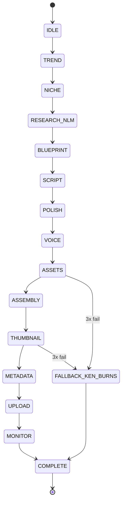
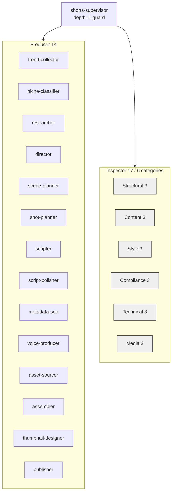
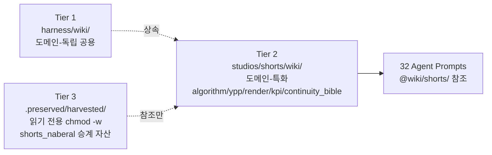

# ARCHITECTURE — naberal-shorts-studio

**⏱ Reading time:** ~28 min (TL;DR 2 min → 5 sections 26 min)
**Last updated:** 2026-04-20
**Audience:** New session loading this codebase for the first time
**Phase status:** Phase 8 완결 (8/8 plans shipped 2026-04-19, 986+ regression green). Phase 9 진행 중 (문서·KPI·Taste Gate 인프라).

---

## TL;DR (⏱ 2 min)

- **What:** AI 에이전트 팀이 자율적으로 YouTube Shorts 주 3~4편을 제작·발행하여 기존 채널을 **YPP 궤도** (1000구독 + 10M views/연)에 올리는 자동 영상제작 스튜디오.
- **Pipeline:** **12 GATE state machine** (IDLE + 13 operational gates — TREND → ... → MONITOR + COMPLETE) — pre_tool_use Hook이 `skip_gates=True`를 물리적으로 차단.
- **Agents:** 총 **32명** = Producer 14 + Inspector 17 (6 categories) + Supervisor 1. 오케스트레이터 500-800줄 제약 (5166줄 드리프트 금지).
- **Wiki:** **3-Tier** — harness/wiki (공용) / studios/shorts/wiki (도메인, 5 categories) / .preserved/harvested (shorts_naberal 승계, chmod -w 읽기 전용).
- **External:** YouTube Data API v3 (업로드) + YouTube Analytics API v2 (KPI — Phase 10 wiring) + **Kling 2.6 Pro (primary I2V, fal.ai) / Veo 3.1 Fast (fallback I2V, fal.ai)** / Nano Banana Pro (scene + thumbnail image) / Typecast / ElevenLabs / Shotstack / NotebookLM. (2026-04-20 세션 #24 최종 확정 — 4차 번복 후 Kling 2.6 Pro primary 확정, Runway Gen-3a Turbo / Gen-4.5 는 production path 미호출 hold 상태).
- **Hard constraints:** No T2V (I2V + Anchor Frame only). No Selenium upload. No K-pop raw audio (AF-13). Orchestrator 500-800 lines. 32 agents fixed (AF-10 전수 이식 금지).
- **Repository:** `github.com/kanno321-create/shorts_studio` (Private, Phase 8 REMOTE-01 완결).

---

## 1. State Machine (12 GATE) (⏱ 6 min)

Phase 5 (ORCH-02/07) 에서 확정된 DAG 기반 게이트 시스템. `scripts/orchestrator/gate_guard.py` 의 `GateName IntEnum` + `GATE_DEPS` 인접리스트가 state machine 전이를 강제한다. 텍스트 체크리스트 방식(구 shorts_naberal 5166줄 오케스트레이터)은 영구 폐기 — 역주행·건너뛰기 시도는 `GateOrderError` raise 로 즉시 중단된다.

게이트 순서는 콘텐츠 파이프라인 flow를 그대로 반영한다: 트렌드 수집 → 니치 분류 → NotebookLM RAG 리서치 → 블루프린트 → 스크립트 → 폴리시 → 보이스 → 에셋 → 어셈블리 → 썸네일 → 메타데이터 → 업로드 → 모니터 → 완주. Fallback Ken Burns 경로는 `ASSETS`/`THUMBNAIL` 3회 실패 시 우회.

### 게이트별 책임

| # | Gate | 책임 | 주요 에이전트 |
|---|------|------|---------------|
| 0 | IDLE | 진입 대기. `dispatch(IDLE)` 없음 (pseudo-state). | — |
| 1 | TREND | Google Trends + YouTube Data API v3 공식 alpha로 24h 트렌드 수집. | `trend-collector` |
| 2 | NICHE | 트렌드 → 탐정/조수 페르소나 호환 여부 분류 (shorts_naberal 승계 니치). | `niche-classifier` |
| 3 | RESEARCH_NLM | NotebookLM 2-notebook (general / channel-bible) RAG 조회. source-grounded citation 필수. | `researcher` |
| 4 | BLUEPRINT | 장면 기획 + 샷 리스트. Continuity Bible prefix 자동 주입. | `director` / `scene-planner` / `shot-planner` |
| 5 | SCRIPT | 한국어 prose 스크립트 (Claude Sonnet 4.6 Producer). | `scripter` |
| 6 | POLISH | 존댓말 일관성 + 리듬 교정. | `script-polisher` |
| 7 | VOICE | Typecast 주력 / ElevenLabs v3 백업 TTS. | `voice-producer` |
| 8 | ASSETS | **Kling 2.6 Pro 주력 (`fal-ai/kling-video/v2.6/pro/image-to-video`, $0.35/5s)** → Veo 3.1 Fast (fal.ai, `veo3.1/fast`, $0.50/5s) 정밀 motion fallback. 둘 다 3회 실패 시 Ken Burns (로컬 FFmpeg). | `asset-sourcer` |
| 9 | ASSEMBLY | Shotstack composite render + filter[0] Continuity Bible prefix. | `assembler` |
| 10 | THUMBNAIL | Nano Banana Pro (Gemini 3 Pro Image) 한국어 텍스트 94-96%. 3회 실패 시 Ken Burns 스틸. | `thumbnail-designer` |
| 11 | METADATA | SEO 타이틀·설명·태그 + AI disclosure 선언. | `metadata-seo` |
| 12 | UPLOAD | YouTube Data API v3 `videos.insert` (1600 units/upload, OAuth InstalledAppFlow). | `publisher` |
| 13 | MONITOR | 업로드 후 7일 + 주 1회 일요일 KST — Analytics v2 pull (Phase 10). | `publisher` (monitor mode) |
| 14 | COMPLETE | 모든 dispatch 기록 검증 후 종료. | Supervisor |

### `verify_all_dispatched()` 계약 (Phase 7 TEST-02 Correction 1)

Phase 7 리서치에서 "17 GATE (12 + 5 sub-gate)"로 최초 기술했으나 `gate_guard.py:169-176` 실구현은 **13 operational gates** (`TREND..MONITOR`) 전수 dispatch 기록을 요구한다. 13 이하에서 `COMPLETE` 전이 시도 시 `GateDispatchMissing` raise. "5 sub-gate"는 inspector/producer 내부 rubric이며 GateGuard dispatch table에 포함되지 않는다. TEST-02는 `dispatched_count == 13` 으로 lock 되어 있다.

**Reference:** `scripts/orchestrator/gate_guard.py` — GateName IntEnum + GATE_DEPS + `dispatch()` + `verify_all_dispatched()` + DAG 정의. `scripts/orchestrator/shorts_pipeline.py` — 실 state machine runner.

---

## 2. Agent Team (17 Inspector / 14 Producer / 1 Supervisor) (⏱ 8 min)

Phase 4 (AGENT-01..05) 에서 확정된 32명 fixed team. shorts_naberal 원본 32 inspector 전수 이식은 **금지** (AF-10) — 17 inspector 6 카테고리 통합 구조로 Anthropic sweet spot(3-5) 대비 과포화 위험을 최소화. Supervisor 는 `depth=1 guard` 로 Task tool 재귀를 차단하여 비용 폭주를 방지한다.

Producer-Reviewer 패턴은 비대칭 구성: Producer = Claude Sonnet 4.6 (속도·비용), Reviewer/Inspector = Opus 4.6 가 critical gate 만 검토. LogicQA (Main-Q + 5 Sub-Q, maxTurns=3) 는 factcheck(10)/tone-brand(5)/regex-style(1) 예외를 제외한 모든 inspector 의 표준 turn budget 이다.

### Producer 14

| # | Agent | 경로 | 주책임 |
|---|-------|------|--------|
| 1 | trend-collector | `.claude/agents/producers/trend-collector/AGENT.md` | Google Trends + YouTube Data API v3 트렌드 수집 |
| 2 | niche-classifier | `.claude/agents/producers/niche-classifier/AGENT.md` | 탐정/조수 페르소나 호환 분류 |
| 3 | researcher | `.claude/agents/producers/researcher/AGENT.md` | NotebookLM 2-notebook RAG 조회 |
| 4 | director | `.claude/agents/producers/director/AGENT.md` | 영상 컨셉 + 톤 결정 |
| 5 | scene-planner | `.claude/agents/producers/scene-planner/AGENT.md` | 장면 블록 기획 |
| 6 | shot-planner | `.claude/agents/producers/shot-planner/AGENT.md` | 샷 리스트 (카메라·렌즈·duration) |
| 7 | scripter | `.claude/agents/producers/scripter/AGENT.md` | Claude Sonnet 4.6 스크립트 생성 |
| 8 | script-polisher | `.claude/agents/producers/script-polisher/AGENT.md` | 존댓말·리듬 교정 |
| 9 | metadata-seo | `.claude/agents/producers/metadata-seo/AGENT.md` | 제목·설명·태그·AI 공시 |
| 10 | voice-producer | `.claude/agents/producers/voice-producer/AGENT.md` | Typecast 주력 / ElevenLabs 백업 |
| 11 | asset-sourcer | `.claude/agents/producers/asset-sourcer/AGENT.md` | Kling 2.6 Pro (primary, fal.ai) / Veo 3.1 Fast (fallback, fal.ai 정밀 motion) I2V 생성 |
| 12 | assembler | `.claude/agents/producers/assembler/AGENT.md` | Shotstack composite render |
| 13 | thumbnail-designer | `.claude/agents/producers/thumbnail-designer/AGENT.md` | Nano Banana Pro 썸네일 |
| 14 | publisher | `.claude/agents/producers/publisher/AGENT.md` | YouTube Data API v3 upload + monitor |

### Inspector 17 / 6 categories

| Category | Count | Members | 책임 요약 |
|----------|-------|---------|-----------|
| Structural | 3 | `ins-schema-integrity`, `ins-timing-consistency`, `ins-blueprint-compliance` | 스키마·타이밍·블루프린트 정합성 |
| Content | 3 | `ins-factcheck`, `ins-narrative-quality`, `ins-korean-naturalness` | 사실성·서사·한국어 자연성 (factcheck maxTurns=10) |
| Style | 3 | `ins-thumbnail-hook`, `ins-tone-brand`, `ins-readability` | 썸네일 후크·톤·가독성 (tone-brand maxTurns=5) |
| Compliance | 3 | `ins-license`, `ins-platform-policy`, `ins-safety` | 저작권·정책·안전성 |
| Technical | 3 | `ins-lufs-audio`, `ins-aspect-ratio`, `ins-subtitle-timing` | 오디오 LUFS·9:16·자막 정렬 |
| Media | 2 | `ins-mosaic`, `ins-gore` | 모자이크·잔혹성 |

### LogicQA pattern (Inspector 표준)

- **Main-Question:** 해당 inspector 의 핵심 판정 기준 1문장
- **Sub-Questions ×5:** 근거·반례·한계·대안·실행 가능성
- **maxTurns:** 3 (표준), 10 (`ins-factcheck`), 5 (`ins-tone-brand`), 1 (regex-style structural)
- **Output:** Pydantic BaseModel JSON schema (PASS/FAIL + rubric score + evidence + remediation)

### VQQA Semantic Gradient Feedback (Phase 4 RUB-03)

Inspector 실패 시 Producer 재시도는 `<prior_vqqa>` 입력 블록을 받는다. VQQA = Vector Quality Question Answer — 단순 PASS/FAIL 이 아니라 "무엇이·왜·어느 정도 부족한지" 의미 gradient 를 전달하여 Producer 가 동일 실패를 반복하지 않도록 한다. `<prior_vqqa>` 는 `rubric_score_delta` + `evidence_excerpt` + `remediation_hint` 3 필드로 구성.

---

## 3. 3-Tier Wiki (⏱ 5 min)

Phase 6 (WIKI-01..06) 에서 확정된 3층 지식 구조. Tier 1 은 도메인-독립 공용 (harness 전체 스튜디오 공유), Tier 2 는 쇼츠 도메인 5 카테고리 (algorithm / ypp / render / kpi / continuity_bible), Tier 3 은 shorts_naberal 승계 자산 (`chmod -w` 물리적 읽기 전용). 쓰기는 오직 Tier 2 에만 허용되며, Tier 3 수정 시도는 OS 레벨에서 차단된다.

RAG 조회는 **NotebookLM Fallback Chain 3-tier** (Phase 6 WIKI-04) 순서로 내려간다: NotebookLM 2-notebook (general / channel-bible) RAG → `grep wiki/` 로컬 검색 → `scripts/orchestrator/*` hardcoded defaults. 가장 빠른 응답은 NotebookLM 에서, 가장 안전한 fallback 은 hardcoded defaults 에서 확보된다.

### Tier 상세

- **Tier 1 — `../../harness/wiki/`** — 도메인-독립 공용. 한국어 존댓말 baseline, YouTube API quota 레퍼런스, GSD workflow 등. 모든 스튜디오(shorts/blog/rocket 등) 가 상속.
- **Tier 2 — `wiki/` (이 스튜디오)** — 5 카테고리 도메인-특화 노드:
  - `algorithm/` — YouTube Shorts 추천 알고리즘 + ranking 요소
  - `ypp/` — YouTube Partner Program 진입 조건 (1000구독 + 10M views/연)
  - `render/` — Remotion v4 + Kling 2.6 Pro (primary) / Veo 3.1 Fast (fallback) 렌더 스택
  - `kpi/` — 3초 retention / 완주율 / 평균 시청 지표 (Phase 9 `kpi_log.md` + `taste_gate_*.md`)
  - `continuity_bible/` — 색상 팔레트 + 카메라 렌즈 + 시각 스타일 prefix (D-1)
- **Tier 3 — `.preserved/harvested/`** — shorts_naberal 승계 자산 읽기 전용 (Phase 3 `chmod -w` 적용). 수정 금지, 참조만.

### NotebookLM 2-Notebook Setup (Phase 6 D-6/D-7)

- **노트북 A (general):** 알고리즘·YPP·렌더 등 도메인 일반 지식. Tier 1 + Tier 2 일반 카테고리 source.
- **노트북 B (channel-bible):** Continuity Bible + 탐정/조수 페르소나 + 색상 팔레트. Tier 2 `continuity_bible/` source.

쿼리는 `scripts/notebooklm/query.py` subprocess wrapper 경유 (대표님 [NotebookLM 쿼리 운영 규칙](.claude/memory/feedback_notebooklm_query.md) 준수: 완성된 1개 문자열 1회 제출, 실시간 타이핑·다중 질문 금지).

### Continuity Bible Prefix 자동 주입

`assembler` 가 Shotstack render payload 의 `filter[0]` 슬롯에 Continuity Bible prefix (색상 팔레트 hex + 카메라 렌즈 mm + 시각 스타일 토큰) 을 자동 주입한다. 수동 설정은 drift 위험. `wiki/continuity_bible/MOC.md` 가 single source of truth.

---

## 4. External Integrations (⏱ 5 min)

외부 서비스 연동은 Phase 5 ~ Phase 8 에 걸쳐 점진적으로 구축되었다. 모든 연동은 **공식 API 전용** 원칙을 따른다 — Selenium / Playwright 기반 업로드 봇은 YouTube ToS 위반 및 채널 차단 위험으로 영구 금지 (AF-8). 비용 폭주 방지를 위해 모든 외부 API 는 circuit breaker (3회 연속 실패 → 5분 cooldown) 뒤에 배치된다.

### YouTube Data API v3 (Phase 8 PUB-02 — 업로드)

- **Endpoint:** `POST https://www.googleapis.com/upload/youtube/v3/videos` (multipart/resumable)
- **OAuth:** `google-auth-oauthlib` InstalledAppFlow — `config/client_secret.json` + `config/youtube_token.json` (refresh token)
- **Quota:** `videos.insert` = 1600 units. 16 업로드/월 = 25,600 units (default 10K/day 충분)
- **Scope:** `https://www.googleapis.com/auth/youtube.upload`
- **Reference:** `scripts/publisher/youtube_uploader.py` + `scripts/publisher/oauth.py`

### YouTube Analytics API v2 (Phase 9 선언 — Phase 10 wiring)

KPI 측정 source. Phase 9 에서는 endpoint + field names + cadence 만 선언하며, 실 연동은 Phase 10 `scripts/analytics/fetch_kpi.py` 에서 발생한다.

- **Endpoint:** `GET https://youtubeanalytics.googleapis.com/v2/reports`
- **OAuth scope:** `https://www.googleapis.com/auth/yt-analytics.readonly`
- **Metrics:** `audienceWatchRatio` (3초·완주 지점 retention) + `averageViewDuration` (평균 시청 초)
- **Dimensions:** `elapsedVideoTimeRatio` (second-resolution retention curve)
- **Filters:** `video==<videoId>;uploaderType==SELF`
- **Cadence:** 업로드 7일 후 + 주 1회 일요일 KST 08:00
- **Shorts shelf:** `trafficSourceType=SHORTS` 별도 집계
- **Reference:** `wiki/kpi/kpi_log.md` Part A API Contract (Phase 9 Plan 09-02)

### GitHub (Phase 8 REMOTE-01..03)

- **Repository:** `github.com/kanno321-create/shorts_studio` (Private)
- **Harness:** `../../harness/` 는 git submodule 으로 고정 (update: `git submodule update --remote harness`)
- **CI:** 없음 (Phase 10 에서 검토). 모든 검증은 로컬 pre_tool_use Hook 로 전담.

### Video Generation Chain (Phase 5 VIDEO-04 + Phase 7 TEST-04)

1. **Primary:** Kling 2.6 Pro ($0.35/5s, $0.07/sec) — fal.ai `kling-video/v2.6/pro/image-to-video`. 한국인 얼굴·신체 움직임·립싱크 내장. Template A (27단어, 3원칙) default.
2. **Fallback:** Veo 3.1 Fast ($0.50/5s, $0.10/sec) — fal.ai `veo3.1/fast/image-to-video`. 정밀/세세한 motion (얼굴 micro / 손가락 / 머리카락 / 미세 light) 에서 Kling 실패 시. Phase 9.1 는 수동 `--use-veo` 플래그, auto-route 는 Phase 10 실패 패턴 축적 후 정식화.
3. **Ken Burns:** 로컬 FFmpeg pan/zoom on still image — 양쪽 모두 3회 실패 시, `ASSETS`/`THUMBNAIL` gate 한정.
4. **Hold (미호출):** Runway Gen-4.5 / Gen-3a Turbo — adapter 유지, production path 제외. 2026-04-20 3-way 실측에서 Kling Pareto-dominant 확인 후 경로 이탈.

### Audio (Phase 4 AUDIO-01)

- **Primary:** Typecast — 한국어 감정 표현 + 존댓말 자연성 1위
- **Fallback:** ElevenLabs Multilingual v3 — 다국어 확장 + $0.12/1K chars

### Composite Render (Phase 5 VIDEO-05)

- **Shotstack** — filter[0] 슬롯에 Continuity Bible prefix 자동 주입. Remotion v4 대체 경로 (시작 시간 지연 방지).

### NotebookLM (Phase 6 D-6/D-7)

- **2-notebook:** 노트북 A (general) + 노트북 B (channel-bible)
- **Wrapper:** `scripts/notebooklm/query.py` subprocess — 완성된 1개 query string 1회 제출
- **Fallback Chain:** NotebookLM RAG → `grep wiki/` → hardcoded defaults (WIKI-04)

---

## 5. Hard Constraints + Hook 3종 (⏱ 3 min)

ROADMAP §300-309 에서 확정된 8개 hard constraint 는 전 phase 에 걸쳐 강제된다. 이 규칙들은 과거 `shorts_naberal` 또는 유사 프로젝트에서 실제로 발생한 사고(AF-1 ~ AF-13)의 직접 대응으로, 하나라도 위반 시 phase gate 통과가 불가능하다.

### Hard Constraints (8종)

1. **`skip_gates=True` 물리 차단** — `pre_tool_use.py` 가 regex 로 차단. CONFLICT_MAP A-6 재발 방지.
2. **`TODO(next-session)` 금지** — `pre_tool_use.py` regex 차단. A-5 재발 방지. 실 미완은 `NotImplementedError` + 명시적 이유 사용.
3. **SKILL.md ≤ 500줄, description ≤ 1024자** — Progressive Disclosure 원칙 (Lost-in-the-Middle 대응).
4. **에이전트 총합 32명 고정** — Producer 14 + Inspector 17 + Supervisor 1. 32 inspector 전수 이식 금지 (AF-10, sweet spot 6배 초과).
5. **오케스트레이터 500~800줄** — 5166줄 드리프트 재발 금지. `scripts/orchestrator/shorts_pipeline.py` + `gate_guard.py` 합산 기준.
6. **`shorts_naberal` 원본 수정 금지** — Harvest 는 `.preserved/harvested/` 에 `chmod -w` 읽기 전용 복사만 (Phase 3 완결).
7. **영상 T2V 금지 — I2V only** — Anchor Frame 강제 (NotebookLM T1). T2V 시도 시 drift scanner 감지.
8. **Selenium 업로드 영구 금지** — YouTube Data API v3 공식만 (AF-8). Makes/n8n 도 공식 API 경유만 허용.
9. **K-pop 트렌드 음원 직접 사용 금지** — KOMCA + Content ID strike 위험 (AF-13). 하이브리드 오디오: 트렌딩 3-5초 → royalty-free crossfade (T11).

### Hook 3종 차단

Phase 5 + Phase 6 에서 확장된 `deprecated_patterns.json` 8 regex 기반 pre_tool_use Hook 가 Write/Edit 실행 전 금지 패턴을 물리적으로 차단한다. `.claude/deprecated_patterns.json` 이 스튜디오별 single source of truth.

1. **`skip_gates=True`** — 게이트 우회 시도 (CONFLICT_MAP A-6). 예: `pipeline.run(skip_gates=True)` → 즉시 deny.
2. **`TODO(next-session)`** — 세션 경계 미완 표식 (A-5). 예: `# TODO(next-session): implement retry` → 즉시 deny. 미완이면 `raise NotImplementedError("XXX 이유로 Phase N 연기")` 로 명시.
3. **try-except 침묵 폴백** — `deprecated_patterns.json` 의 `try:\s*\n\s+.+\n\s+except.*:\s*pass` 패턴 감지. 명시적 `raise` + GATE 기록 필수.

### FAILURES.md Append-Only Hook (Phase 6 D-11)

`check_failures_append_only` Hook 이 `.claude/failures/FAILURES.md` 의 기존 content 를 prefix 로 보존하지 않는 Write 를 거부한다. `scripts/taste_gate/record_feedback.py` (Phase 9 Plan 09-04) 는 반드시 `open(path, "a", encoding="utf-8")` append mode 로 작성. Phase 6 D-14 sha256 immutable lock 과 결합하여 과거 FAILURES entry 는 물리적으로 불변.

### SKILL_HISTORY 백업 Hook (Phase 6 D-12)

`backup_skill_before_write` Hook 이 `SKILL.md` Write 전 `.claude/SKILL_HISTORY/YYYY-MM-DD-HHMMSS-<name>.md` 로 자동 백업한다. SKILL 회귀 발생 시 복원 경로.

### 30일 집약 파이프라인 (Phase 6 D-13)

`.claude/failures/FAILURES.md` 에 동일 패턴 ≥ 3건 축적 → `scripts/failures/aggregate_patterns.py` 가 `SKILL.md.candidate` 생성 → 7일 staged rollout 검토 → 대표님 승인 시 SKILL.md 반영. Phase 10 첫 1-2개월은 D-2 저수지 규율로 **자동 patch 금지**, 수동 검토만 허용.

---

## References

### 내부 계획 문서
- `.planning/ROADMAP.md` — 전체 10 phase 로드맵 + 8 hard constraint
- `.planning/REQUIREMENTS.md` — REQ 전체 + Phase 9 KPI-05/06
- `.planning/STATE.md` — 세션별 실행 상태 + 회고

### Phase 별 SUMMARY (완결 phase 하이퍼링크)
- [Phase 1 — Boot & Domain Charter](../.planning/phases/01-boot-domain-charter/)
- [Phase 2 — Domain Definition](../.planning/phases/02-domain-definition/)
- [Phase 3 — Harvest from shorts_naberal](../.planning/phases/03-harvest-from-shorts-naberal/)
- [Phase 4 — Agent Team Design](../.planning/phases/04-agent-team-design/)
- [Phase 5 — Orchestrator v2 Write](../.planning/phases/05-orchestrator-v2-write/)
- [Phase 6 — Wiki + NotebookLM + FAILURES 저수지](../.planning/phases/06-wiki-notebooklm-integration-failures-reservoir/)
- [Phase 7 — Integration Test](../.planning/phases/07-integration-test/)
- [Phase 8 — Remote Publishing + Production Metadata](../.planning/phases/08-remote-publishing-production-metadata/)

### Phase 9 동반 문서 (이 phase 의 companion artifacts)
- `wiki/kpi/kpi_log.md` — KPI 목표 선언 + 월별 추적 (Plan 09-02)
- `wiki/kpi/taste_gate_protocol.md` — 월 1회 대표님 평가 프로토콜 (Plan 09-03)
- `wiki/kpi/taste_gate_2026-04.md` — 첫 dry-run synthetic 6 sample (Plan 09-03)
- `scripts/taste_gate/record_feedback.py` — FAILURES.md auto-append (Plan 09-04)

### 하네스 원칙
- `../../harness/docs/ARCHITECTURE.md` — naberal_harness v1.0.1 원칙
- `../../harness/wiki/` — Tier 1 도메인-독립 공용 지식

### 운영 레퍼런스
- `CLAUDE.md` — 나베랄 감마 정체성 + 대표님 운영 원칙
- `.claude/deprecated_patterns.json` — 8 regex 금지 패턴
- `.claude/failures/FAILURES.md` — 실패 저수지 (append-only)

---

*Document created: 2026-04-20 (Phase 9 Plan 09-01, session #24)*
*Next milestone: Phase 10 — Sustained Operations (실 KPI 수집 + 첫 Taste Gate 실행)*
