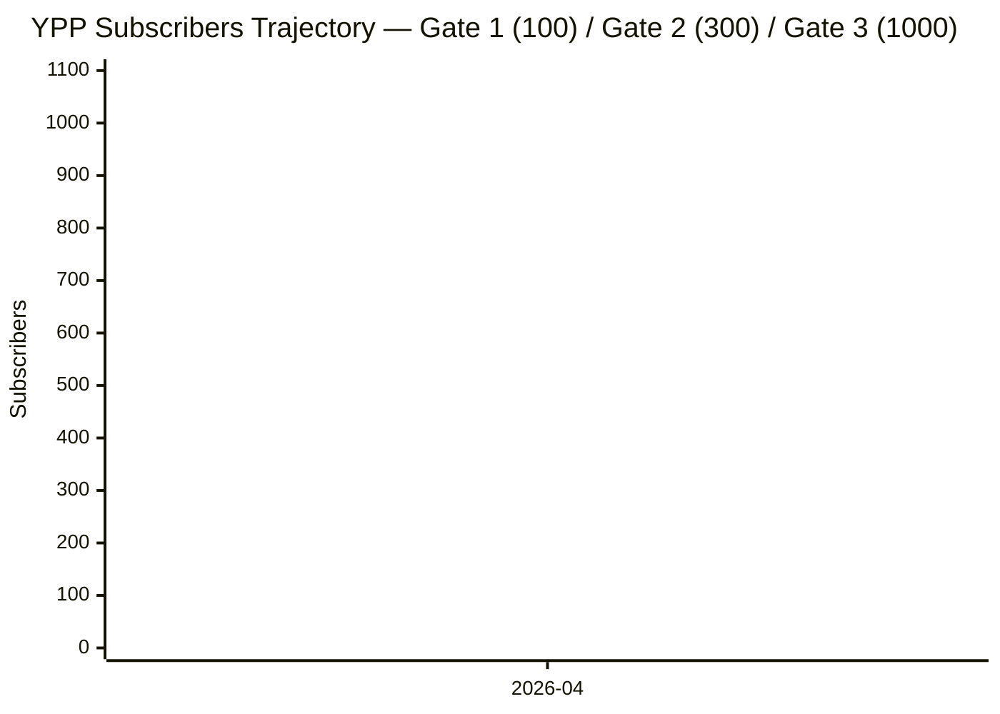

# YPP Trajectory — naberal-shorts-studio

> Phase 10 SC#6 (ROADMAP §276) 실증 노드. 월 1회 `scripts/analytics/trajectory_append.py` 가 구독자/뷰/3-gate 진행률을 append + Mermaid 재생성. 수동 편집은 3-Milestone Gates 섹션 + Pivot Warning Thresholds 섹션만 허용 (monthly snapshots / trajectory chart 는 스크립트가 관리).

**Phase 10 시작일**: 2026-04-20

## 3-Milestone Gates

Phase 10 CONTEXT §Exit Criterion (Locked by 대표님 delegation) — 3단계 milestone gate 는 경영자용 pivot 판단 근거. YPP 공식 계산은 rolling 12개월이지만, 3/6/12개월 단계별 평가로 "이대로 가면 된다 / 전략 재검토 필요" 를 조기 판별한다.

| Gate | Deadline | Threshold | 미달 조치 |
|------|----------|----------:|-----------|
| **1차** | 2026-07-20 (3개월) | subs >= 100 | 니치/훅 iteration Plan 추가 (Phase 11 candidate). FAILURES.md F-YPP-NN append. |
| **2차** | 2026-10-20 (6개월) | subs >= 300 + retention_3s >= 0.60 | 전략 재검토 + taste gate 주기 상향 (월 1회 → 2주 1회). FAILURES.md F-YPP-NN append. |
| **3차** | 2027-04-20 (12개월) | rolling-12m subs >= 1000 + views >= 10M | 달성 월에 YPP 진입 + Phase 10 "성공 선언" (sustained는 계속). 미달 시 전체 전략 rebuild. |

## Monthly Snapshots

> `scripts/analytics/trajectory_append.py --subs N --views-12m M --retention-3s R --year-month YYYY-MM` 실행 시 아래 마커 직후에 row append. 동일 month 재실행 시 기존 row replace (idempotent). Gate 미달 시 FAILURES.md F-YPP-NN append.

| Month | Subs | Rolling12mViews | 1stGate% | 2ndGateSubs% | 3rdGateSubs% | 3rdGateViews% | Notes |
|-------|-----:|----------------:|---------:|-------------:|-------------:|--------------:|-------|
<!-- TRAJECTORY_APPEND_MARKER -->

## Trajectory Chart

> 구독자 진행 Mermaid xychart. `trajectory_append.py` 실행 시 x-axis (월 labels) + line (구독자 수) 가 모든 누적 snapshot 으로 재생성된다. 초기값은 Phase 10 시작월만 (0 구독).

<!-- MERMAID_DATA_MARKER -->

## Pivot Warning Thresholds

`trajectory_append.py` 가 월별 append 시 자동 평가. 미달 시 FAILURES.md F-YPP-NN entry append + stdout `pivot_required: true`.

1. **1차 gate (month_since_start >= 3)** — subs < 100 → "1st gate FAIL — 니치/훅 iteration 필요". Phase 11 candidate (니치 pivot Plan).
2. **2차 gate (month_since_start >= 6, subs axis)** — subs < 300 → "2nd gate FAIL subs". 전략 재검토 + taste gate 주기 상향.
3. **2차 gate (month_since_start >= 6, retention axis)** — retention_3s < 0.60 → "2nd gate FAIL retention". 3초 hook iteration + NotebookLM RAG 상위 retention 패턴 재주입.

## Cross-References

- [[MOC]] — YPP 카테고리 index
- [[entry_conditions]] — 2026 YPP 공식 요건 (1000 subs + 10M views/90d) + 한국 RPM baseline
- [[../kpi/kpi_log]] — 월별 composite score (Plan 10-03 monthly_aggregate.py append)
- [[../kpi/taste_gate_protocol]] — 월 1회 대표님 평가 (2차 gate retention 원천 데이터)
- `.planning/phases/10-sustained-operations/10-CONTEXT.md` §Exit Criterion — 3-milestone gate locked decision
- `.planning/ROADMAP.md` §276 — Phase 10 SC#6 원문

---

*Scaffolded: 2026-04-20 (Phase 10 Plan 07 SC#6)*
*Auto-updated by: `scripts/analytics/trajectory_append.py` (월 1회)*
